# Hierarchical Nmixture models for species interactions - Simulations
Ben Weinstein - Stony Brook University  


```
## [1] "Run Completed at 2016-08-27 07:20:28"
```

#Simulation   

## Parameters

* 10 hummingbird species
* 10 plant species
* Range of hummingbird bill sizes (in mm) ~ Pois(10)/10
* Range of corolla sizes (in mm) ~ Pois(15)/10
* Mean frequeny ($\lambda$) for each hummingbird is drawn from U(0,10)  
* Trait matching (minimizing Bill-Corolla difference) is drawn from a hierarcichal distribution
$$log(\lambda)<-\alpha_i + \beta_i *traitmatch$$
$$\alpha=N(3,0.2)$$
$$\beta1 = N(-1,0.2)$$

* Imperfect detection 
* $$ p_i = U(0.1,0.9) $$ 
* 10 camera
* 3 days per camera

**View simulated strength and form of trait matching **


```r
#load("AbundanceSimulation.RData")
gc()
```

```
##          used (Mb) gc trigger (Mb) max used (Mb)
## Ncells 509958 27.3     940480 50.3   750400 40.1
## Vcells 704320  5.4    1308461 10.0  1014801  7.8
```

#Simulation Parameters


```r
#Number of hummingbird species
h_species=10
plant_species=10
cameras<-5
days<-3

#Bill sizes
Bill<-rpois(h_species,10)

#Corolla sizes
Corolla<-rpois(plant_species,15)

#Subtract both and take absolute value, convert cm
traitmatch<-abs(sapply(Corolla,function(x) x - Bill)/10)
  
#regression slopes
#traits
beta1_mu<- -1

#abundance

#species variance in slopes
beta1_sigma<- 0.2

#Species alpha_mu 
alpha_mu<- 3
alpha_sigma<- 0.2

#Poisson overdipersion
tauE<-10

#species level
detection= inv.logit(rnorm(h_species,0,1.67))
beta1<-rnorm(h_species,beta1_mu,beta1_sigma)
alpha<-rnorm(h_species,alpha_mu,alpha_sigma)
```

#Compute resource abundance


```r
resources<-array(NA,dim=c(h_species,plant_species,cameras))

#fill for each month
for (x in 1:cameras){
   resources[,,x]<-rpois(1,10)   
  }
resources<-array(data=scale(resources),dim=c(h_species,plant_species,cameras))
```

#Compute true interaction matrices


```r
#for each species loop through and create a replicate dataframe
obs<-array(dim=c(h_species,plant_species,cameras,days))
lambda<-array(dim=c(h_species,plant_species,cameras))
N<-array(dim=c(h_species,plant_species,cameras))

#create intensities
for(x in 1:h_species){
  for (y in 1:plant_species){
    for (z in 1:cameras){
      lambda[x,y,z]<-exp(alpha[x] + beta1[x] * traitmatch[x,y] + rnorm(1,0,1/sqrt(tauE)))
  }
  }
}


#draw latent states
for(x in 1:h_species){
  for (y in 1:plant_species){
    for (z in 1:cameras){
      # true latent count
      N[x,y,z]<-rpois(1,lambda[x,y,z])
    }
  }
}

#Observed counts in each day
for(x in 1:h_species){
  for (y in 1:plant_species){
    for (z in 1:cameras){
        for (d in 1:days){
      #true detection rate of that observed count
      obs[x,y,z,d]<-rbinom(1,N[x,y,z],p=detection[x])
      }
    }
  }
}
```

##View correlation in simulated latent state


```r
mdat<-melt(N)
colnames(mdat)<-c("Bird","Plant","Camera","Interactions")

traitmelt<-melt(traitmatch)
colnames(traitmelt)<-c("Bird","Plant","traitmatch")

mdat<-merge(mdat,traitmelt,c("Bird","Plant"))
ggplot(mdat,aes(x=traitmatch,y=Interactions,col=as.factor(Bird))) + geom_point() + geom_smooth(aes(group=1),method="glm",method.args = list(family = "poisson")) + labs(col="Bird") + xlab("Absolute value of Bill Length - Corolla Length ")
```


```r
#Merge resources
mr<-melt(resources)
colnames(mr)<-c("Bird","Plant","Camera","Abundance")
mdat<-merge(mdat,mr,by=c("Bird","Plant","Camera"))
```

##View Detection Rates


```r
obs.state<-melt(obs)
colnames(obs.state)<-c("Bird","Plant","Camera","Day","Yobs")
obs.state<-merge(mdat,obs.state,by=c("Bird","Plant","Camera"))
ggplot(obs.state,aes(x=Interactions,y=Yobs,col=Camera)) + geom_point() + theme_bw() + geom_abline() + coord_equal()
```

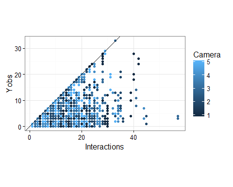

# Hierarcichal Nmixture Model

For hummingbird i visiting plant j recorded by camera k on day d:

$$ Y_{i,j,k,d} \sim Binom(N_{i,j,k},\omega_i)$$
$$N_{i,j,k} \sim Pois(\lambda_{i,j}) $$
$$log(\lambda_{i,j})<-\alpha_i + \beta_{1,i} * |Bill_i - Corolla_j| * \beta_{2,i} * Abundance_{j,k} + \epsilon$$
$$ \epsilon \sim Normal(0,\tau_\epsilon)$$

**Priors**

Please recall that jags parameterizes models using precision, not sd (precision = 1/sd^2)

$$\omega_i \sim (\mu_{\omega},\tau_{\omega})$$  $$\mu_{\omega} \sim Normal(0,0.5)   
$$\tau_{\omega} \sim Uniform(0,10)

$$\alpha_i \sim Normal(\mu_{\alpha},\tau_{\alpha})$$
$$\beta_{i,1} \sim Normal(\mu_{\beta_1},\tau_{\beta_1})$$

**Hyperpriors**
$$\mu_{\alpha} \sim Normal(0,0.0001)$$
$$\mu_{\beta_1} \sim Normal(0,0.0001)$$
$$\mu_{\beta_2} \sim Normal(0,0.0001)$$

$$\tau_{\alpha} \sim Half-T(0.0001,0.0001)$$
$$\sigma_{\alpha} = \sqrt[2]{\frac{1}{\tau_\alpha}}$$

$$\tau_{\beta_1} \sim \sqrt[2]{\frac{1}{\sigma_{\beta_1}}}$$
$$\sigma_{\beta_1} \sim Half-T(0,1)$$

$$\tau_{\beta_2} \sim \sqrt[2]{\frac{1}{\sigma_{\beta_2}}}$$
$$\sigma_{\beta_2} \sim Half-T(0,1)$$


#Simulated data without detection


```r
runs<-30000
#Source model
source("Bayesian/NoDetectNmixturePoissonRagged.R")

#print model
print.noquote(readLines("Bayesian//NoDetectNmixturePoissonRagged.R"))
```

```
##  [1]                                                                               
##  [2] sink("Bayesian/NoDetectNmixturePoissonRagged.jags")                           
##  [3]                                                                               
##  [4] cat("                                                                         
##  [5]     model {                                                                   
##  [6]     #Compute intensity for each pair of birds and plants                      
##  [7]     for (i in 1:Birds){                                                       
##  [8]     for (j in 1:Plants){                                                      
##  [9]     for (k in 1:Cameras){                                                     
## [10]                                                                               
## [11]     #Process Model with log normal overdispersion                             
## [12]     log(lambda[i,j,k])<-alpha[i] + beta1[i] * Traitmatch[i,j] + epsilon[i,j,k]
## [13]                                                                               
## [14]     #Log transformed variance in counts                                       
## [15]     epsilon[i,j,k] ~ dnorm(0,tauE)                                            
## [16]                                                                               
## [17]     }                                                                         
## [18]     }                                                                         
## [19]     }                                                                         
## [20]                                                                               
## [21]     for (x in 1:Nobs){                                                        
## [22]                                                                               
## [23]       # Observed State                                                        
## [24]       Yobs[x] ~ dpois(lambda[Bird[x],Plant[x],Camera[x]])                     
## [25]                                                                               
## [26]       #Assess Model Fit                                                       
## [27]                                                                               
## [28]       #Fit discrepancy statistics                                             
## [29]       eval[x]<-lambda[Bird[x],Plant[x],Camera[x]]                             
## [30]       E[x]<-pow((Yobs[x]-eval[x]),2)/(eval[x]+0.5)                            
## [31]                                                                               
## [32]       ynew[x]~dpois(lambda[Bird[x],Plant[x],Camera[x]])                       
## [33]       E.new[x]<-pow((ynew[x]-eval[x]),2)/(eval[x]+0.5)                        
## [34]                                                                               
## [35]       }                                                                       
## [36]                                                                               
## [37]     #Process Model                                                            
## [38]     #Species level priors                                                     
## [39]     for (i in 1:Birds){                                                       
## [40]                                                                               
## [41]     #Intercept                                                                
## [42]     alpha[i] ~ dnorm(alpha_mu,alpha_tau)                                      
## [43]                                                                               
## [44]     #Traits slope                                                             
## [45]     beta1[i] ~ dnorm(beta1_mu,beta1_tau)                                      
## [46]     }                                                                         
## [47]                                                                               
## [48]     #Group process priors                                                     
## [49]                                                                               
## [50]     #Intercept                                                                
## [51]     alpha_mu ~ dnorm(0,0.001)                                                 
## [52]     alpha_tau ~ dt(0,1,1)I(0,)                                                
## [53]     alpha_sigma<-pow(1/alpha_tau,0.5)                                         
## [54]                                                                               
## [55]     #Trait                                                                    
## [56]     beta1_mu~dnorm(0,0.001)                                                   
## [57]     beta1_tau ~ dt(0,1,1)I(0,)                                                
## [58]     beta1_sigma<-pow(1/beta1_tau,0.5)                                         
## [59]                                                                               
## [60]     #Overdispersion                                                           
## [61]     #Overdispersion                                                           
## [62]     tauSigma ~ dunif(0,4)                                                     
## [63]     tauE <- pow(1/tauSigma,2)                                                 
## [64]                                                                               
## [65]     #derived posterior check                                                  
## [66]     fit<-sum(E[]) #Discrepancy for the observed data                          
## [67]     fitnew<-sum(E.new[])                                                      
## [68]                                                                               
## [69]                                                                               
## [70]     }                                                                         
## [71]     ",fill=TRUE)                                                              
## [72]                                                                               
## [73] sink()
```

```r
  #for parallel run
  Yobs=obs.state$Yobs
  Bird=obs.state$Bird
  Plant=obs.state$Plant
  Plants=max(obs.state$Plant)
  Cameras=max(obs.state$Camera)
  Camera=obs.state$Camera
  Traitmatch=traitmatch
  Birds=max(obs.state$Bird)
  Nobs=length(obs.state$Yobs)
  resources=resources

  #Inits
  Ninit<-array(dim=c(h_species,plant_species,Cameras),data=1)

  InitStage <- function() {list(epsilon=Ninit)}

  #Parameters to track
  ParsStage <- c("alpha","beta1","alpha_mu","beta1_sigma","alpha_sigma","ynew","beta1_mu","fit","fitnew","tauE")
  
  #MCMC options
  ni <- runs  # number of draws from the posterior
  nt <- 4   #thinning rate
  nb <- max(0,runs-2000) # number to discard for burn-in
  nc <- 2  # number of chains

  Dat<-list("Yobs","Bird","Plant","Plants","Traitmatch","Birds","Nobs","Cameras","Camera","resources","Ninit")

    sim_niave<-do.call(jags.parallel,list(data=Dat,InitStage,parameters.to.save=ParsStage,model.file="Bayesian/NoDetectNmixturePoissonRagged.jags",n.thin=nt, n.iter=ni,n.burnin=nb,n.chains=nc))
```


```r
#recompile if needed
load.module("dic")
runs<-5000
recompile(sim_niave)
sim_niave<-update(sim_niave,n.iter=runs,n.burnin=runs*.95,n.thin=10)
```


```r
pars_niave<-extract_par(sim_niave,data=obs.state,ynew=T)
pars_niave$Model<-c("Poisson GLMM")
```

##Assess Convergence


```r
ggplot(pars_niave[pars_niave$par %in% c("alpha","beta1"),],aes(x=Draw,y=estimate,col=as.factor(Chain))) + geom_line() + facet_grid(par~species,scale="free") + theme_bw() + labs(col="Chain") + ggtitle("Detection Probability")
```


```r
ggplot(pars_niave[pars_niave$par %in% c("beta1_mu","beta1_sigma","tauE"),],aes(x=Draw,y=estimate,col=as.factor(Chain))) + geom_line() + theme_bw() + labs(col="Chain") + ggtitle("Trait-matching regression") + facet_wrap(~par,scales="free")
```

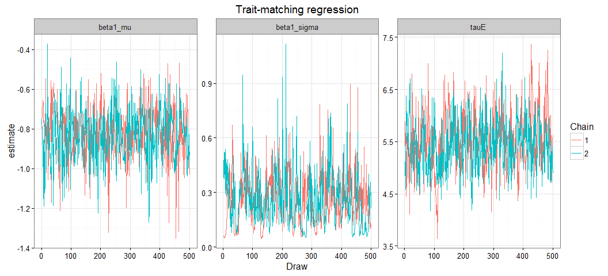

##Posteriors


```r
###Posterior Distributions
p<-ggplot(pars_niave[pars_niave$par %in% c("alpha","beta1"),],aes(x=estimate)) + geom_histogram() + ggtitle("Estimate of parameters") + facet_grid(species~par,scales="free") + theme_bw() + ggtitle("Species Posteriors")

#Add true values
tr<-melt(data.frame(species=1:length(detection),alpha=alpha,beta1=beta1),id.var='species')
colnames(tr)<-c("species","par","value")
psim<-p + geom_vline(data=tr,aes(xintercept=value),col='red',linetype='dashed',size=1)
psim
```

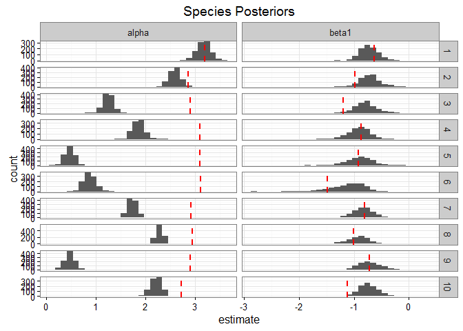

```r
ggsave("Figures/SimulationPosteriorsNoDetect.jpg",dpi=300,height=8,width=8)
```


```r
p<-ggplot(pars_niave[pars_niave$par %in% c("beta1_mu","alpha_mu","alpha_sigma","beta1_sigma","tauE"),],aes(x=estimate)) + geom_histogram() + ggtitle("Hierarchical Posteriors") + facet_grid(~par,scale="free") + theme_bw()

#Add true values
tr<-melt(list(beta1_mu=beta1_mu,alpha_mu=alpha_mu,alpha_sigma=alpha_sigma,beta1_sigma=beta1_sigma,tauE=tauE))

colnames(tr)<-c("value","par")

psim2<-p + geom_vline(data=tr,aes(xintercept=value),linetype='dashed',size=1,col="red")
```

**True values are given in the dashed lines.**

##Predicted Relationship 


```r
castdf<-group_by(pars_niave,Chain) %>% select(par,estimate) %>% filter(par %in% c("beta1_mu","alpha_mu"))

castdf<-dcast(pars_niave[pars_niave$par %in% c("beta1_mu","alpha_mu"),], Chain + Draw~par,value.var="estimate")

#calculated predicted y
predyniave_trait<-trajF(alpha=castdf$alpha_mu,beta1=castdf$beta1_mu,trait=as.numeric(traitmatch),resources=as.numeric(resources[,1,]),tauSigma = 1/sqrt(tauE))

predyniave_both<-trajF(alpha=castdf$alpha_mu,beta1=castdf$beta1_mu,trait=as.numeric(traitmatch),resources=as.numeric(resources[,1,]),tauSigma=1/sqrt(tauE))
```

# Simulated data with detection


```r
runs<-30000

#Source model
source("Bayesian/NmixturePoissonRagged.R")

#print model
print.noquote(readLines("Bayesian//NmixturePoissonRagged.R"))
```

```
##  [1]                                                                                  
##  [2] sink("Bayesian/NmixturePoissonRagged.jags")                                      
##  [3]                                                                                  
##  [4] cat("                                                                            
##  [5]     model {                                                                      
##  [6]     #Compute intensity for each pair of birds and plants                         
##  [7]     for (i in 1:Birds){                                                          
##  [8]     for (j in 1:Plants){                                                         
##  [9]     for (k in 1:Times){                                                          
## [10]                                                                                  
## [11]     #Process Model with log normal overdispersion                                
## [12]     #mean intensity                                                              
## [13]                                                                                  
## [14]     #log transformed variance                                                    
## [15]     log(lambda[i,j,k]) <- alpha[i] + beta1[i] * Traitmatch[i,j] +  epsilon[i,j,k]
## [16]     epsilon[i,j,k] ~ dnorm(0,tauE)                                               
## [17]                                                                                  
## [18]     #For each Time - there is a latent count, log transformed intensity          
## [19]     N[i,j,k] ~ dpois(lambda[i,j,k])                                              
## [20]     }                                                                            
## [21]     }                                                                            
## [22]     }                                                                            
## [23]                                                                                  
## [24]     #Observed counts for each day of sampling at that Time                       
## [25]     for (x in 1:Nobs){                                                           
## [26]                                                                                  
## [27]     #Observation Process                                                         
## [28]     Yobs[x] ~ dbin(detect[Bird[x]],N[Bird[x],Plant[x],Time[x]])                  
## [29]                                                                                  
## [30]     #Assess Model Fit                                                            
## [31]                                                                                  
## [32]     #Fit discrepancy statistics                                                  
## [33]     eval[x]<-detect[Bird[x]]*N[Bird[x],Plant[x],Time[x]]                         
## [34]     E[x]<-pow((Yobs[x]-eval[x]),2)/(eval[x]+0.5)                                 
## [35]                                                                                  
## [36]     ynew[x]~dbin(detect[Bird[x]],N[Bird[x],Plant[x],Time[x]])                    
## [37]     E.new[x]<-pow((ynew[x]-eval[x]),2)/(eval[x]+0.5)                             
## [38]                                                                                  
## [39]     }                                                                            
## [40]                                                                                  
## [41]     ###Priors###                                                                 
## [42]     #Observation model                                                           
## [43]     #Detect priors, logit transformed - Following lunn 2012 p85                  
## [44]                                                                                  
## [45]     for(x in 1:Birds){                                                           
## [46]     #For Cameras                                                                 
## [47]     logit(detect[x])<-dcam[x]                                                    
## [48]     dcam[x]~dnorm(0,0.386)                                                       
## [49]     }                                                                            
## [50]                                                                                  
## [51]     #Process Model                                                               
## [52]     #Species level priors                                                        
## [53]     for (i in 1:Birds){                                                          
## [54]                                                                                  
## [55]     #Intercept                                                                   
## [56]     alpha[i] ~ dnorm(alpha_mu,alpha_tau)                                         
## [57]                                                                                  
## [58]     #Traits slope                                                                
## [59]     beta1[i] ~ dnorm(beta1_mu,beta1_tau)                                         
## [60] }                                                                                
## [61]                                                                                  
## [62]     #Group process priors                                                        
## [63]                                                                                  
## [64]     #Intercept                                                                   
## [65]     alpha_mu ~ dnorm(0,0.001)                                                    
## [66]     alpha_tau ~ dt(0,1,1)I(0,)                                                   
## [67]     alpha_sigma<-pow(1/alpha_tau,0.5)                                            
## [68]                                                                                  
## [69]     #Trait                                                                       
## [70]     beta1_mu~dnorm(0,0.001)                                                      
## [71]     beta1_tau ~ dt(0,1,1)I(0,)                                                   
## [72]     beta1_sigma<-pow(1/beta1_tau,0.5)                                            
## [73]                                                                                  
## [74]     #Overdispersion                                                              
## [75]     tauSigma ~ dunif(0.01,5)                                                     
## [76]     tauE <- pow(1/tauSigma,2)                                                    
## [77]                                                                                  
## [78]     #derived posterior check                                                     
## [79]     fit<-sum(E[]) #Discrepancy for the observed data                             
## [80]     fitnew<-sum(E.new[])                                                         
## [81]                                                                                  
## [82]                                                                                  
## [83]     }                                                                            
## [84]     ",fill=TRUE)                                                                 
## [85]                                                                                  
## [86] sink()
```

```r
  #for parallel run
  Yobs=obs.state$Yobs
  Bird=obs.state$Bird
  Plant=obs.state$Plant
  Time=obs.state$Camera
  Times=max(obs.state$Camera)
  Traitmatch=traitmatch
  Birds=max(obs.state$Bird)
  Plants=max(obs.state$Plant)
  Nobs=length(obs.state$Yobs)
  resources=resources

  #A blank Y matrix - all present
  Ninit<-array(dim=c(h_species,plant_species,Times),data=max(obs.state$Yobs)*1)


  #Inits
  InitStage <- function() {list(N=Ninit,epsilon=Ninit/10)}
  
  #Parameters to track
  ParsStage <- c("detect","tauE","alpha","beta1","alpha_mu","alpha_sigma","beta1_sigma","ynew","beta1_mu","fit","fitnew")
  
  #MCMC options
  ni <- runs  # number of draws from the posterior
  nt <- 8  #thinning rate
  nb <- max(0,runs-2000) # number to discard for burn-in
  nc <- 2  # number of chains

  Dat<-list("Yobs","Bird","Plant","Plants","Traitmatch","resources","Birds","Nobs","Ninit","Time","Times")

    system.time(sim_detect<-do.call(jags.parallel,list(Dat,InitStage,ParsStage,model.file="Bayesian/NmixturePoissonRagged.jags",n.thin=nt, n.iter=ni,n.burnin=nb,n.chains=nc)))
```

```
##    user  system elapsed 
##    2.50    0.08 1173.27
```


```r
#recompile if needed
load.module("dic")
runs<-10000
recompile(sim_detect)
system.time(sim_detect<-update(sim_detect,n.iter=runs,n.burnin=runs*.95,n.thin=10,parameters.to.save=ParsStage))
```


```r
pars<-extract_par(sim_detect,data=obs.state,ynew=T)
pars$Model<-"Nmixture"
```

##Assess Convergence


```r
ggplot(pars[pars$par %in% c("detect","alpha","beta1"),],aes(x=Draw,y=estimate,col=as.factor(Chain))) + geom_line() + facet_grid(par~species,scale="free") + theme_bw() + labs(col="Chain") + ggtitle("Detection Probability")
```

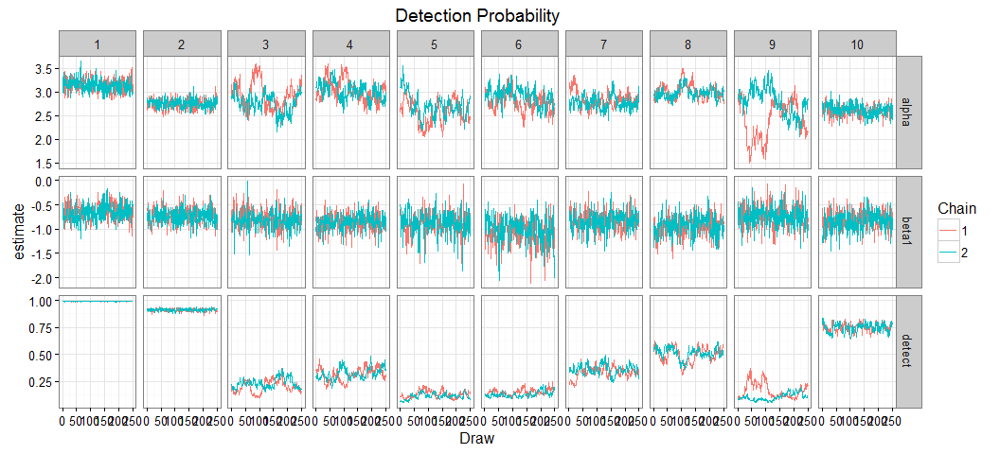


```r
ggplot(pars[pars$par %in% c("beta1_mu","alpha_sigma","beta1_sigma","tauE"),],aes(x=Draw,y=estimate,col=as.factor(Chain))) + geom_line() + theme_bw() + labs(col="Chain") + ggtitle("Trait-matching regression") + facet_wrap(~par,scales="free")
```


##Posteriors


```r
###Posterior Distributions
p<-ggplot(pars[pars$par %in% c("detect","alpha","beta1"),],aes(x=estimate)) + geom_histogram() + ggtitle("Estimate of parameters") + facet_grid(species~par,scales="free") + theme_bw() + ggtitle("Species Posteriors")

#Add true values
tr<-melt(data.frame(species=1:length(detection),detect=detection,alpha=alpha,beta1=beta1),id.var='species')
colnames(tr)<-c("species","par","value")
psim<-p + geom_vline(data=tr,aes(xintercept=value),col='red',linetype='dashed',size=1)
#ggsave("Figures/SimulationPosteriors.jpg",dpi=300,height=8,width=8)
```


```r
p<-ggplot(pars[pars$par %in% c("beta1_mu","alpha_mu","alpha_sigma","beta1_sigma","tauE"),],aes(x=estimate)) + geom_histogram() + ggtitle("Hierarchical Posteriors") + facet_wrap(~par,scale="free",nrow=2) + theme_bw() 

#Add true values
tr<-melt(list(beta1_mu=beta1_mu,alpha_mu=alpha_mu,alpha_sigma=alpha_sigma,beta1_sigma=beta1_sigma,tauE=tauE))

colnames(tr)<-c("value","par")

psim2<-p + geom_vline(data=tr,aes(xintercept=value),linetype='dashed',size=1,col="black")
#ggsave("Figures/SimulationH.jpg",dpi=300,height=4,width=10)
```

**True values are given in the dashed lines.**

##Compare simulation posteriors with and without detection


```r
#Bind to other dataset
parsall<-rbind.data.frame(pars[!pars$par %in% "ynew",],pars_niave[!pars_niave$par %in% "ynew",])
parsall$Model<-as.factor(parsall$Model)

###Posterior Distributions
p<-ggplot(parsall[parsall$par %in% c("detect","alpha","beta1"),],aes(x=estimate,fill=Model)) + geom_histogram(position="identity") + ggtitle("Estimate of parameters") + facet_grid(species~par,scales="free") + theme_bw() 

#Add true values
tr<-melt(data.frame(species=1:length(detection),detect=detection,alpha=alpha,beta1=beta1),id.var='species')
colnames(tr)<-c("species","par","value")
psim<-p + geom_vline(data=tr,aes(xintercept=value),col='black',linetype='dashed',size=1)
psim
```

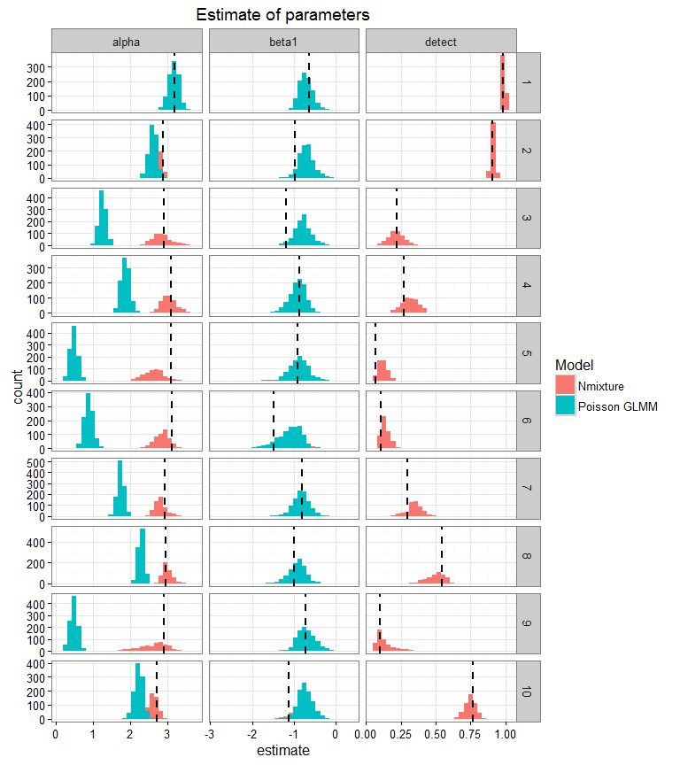

```r
#ggsave("Figures/SimulationPosteriorsBoth.jpg",dpi=300,height=8,width=8)
```


```r
p<-ggplot(parsall[parsall$par %in% c("beta1_mu","alpha_mu","alpha_sigma","beta1_sigma","tauE_mu","tauE_tau"),],aes(x=estimate,fill=Model)) + geom_histogram(position="identity") + ggtitle("Hierarchical Posteriors") + facet_wrap(~par,scale="free",nrow=2) + theme_bw() 

#Add true values
tr<-melt(list(beta1_mu=beta1_mu,alpha_mu=alpha_mu,alpha_sigma=alpha_sigma,beta1_sigma=beta1_sigma,tauE=tauE))

colnames(tr)<-c("value","par")

psim2<-p + geom_vline(data=tr,aes(xintercept=value),linetype='dashed',size=1,col="black")
psim2
```


```r
#ggsave("Figures/SimulationHBoth.jpg",dpi=300,height=4,width=10)
```

##Strip plots
Plot the posterior mean density

```r
spars<-parsall %>% filter(par %in% c("alpha","beta1","detect")) %>% group_by(Model,species,par) %>% summarize(mean=mean(estimate),lower=quantile(estimate,0.05),upper=quantile(estimate,0.95))

tr<-melt(data.frame(species=1:length(detection),detect=detection,alpha=alpha,beta1=beta1,tauE=tauE),id.var='species')
colnames(tr)<-c("species","par","value")

ggplot(spars,aes(x=Model,ymin=lower,ymax=upper,y=mean,col=Model)) + geom_linerange(size=1.3) + facet_grid(par~species,scales="free") + geom_hline(data=tr,aes(yintercept=value),linetype='dashed',size=1,col="black") + geom_point(aes(y=mean),col='grey50',size=2) + theme_bw() + ylab("Estimate")
```

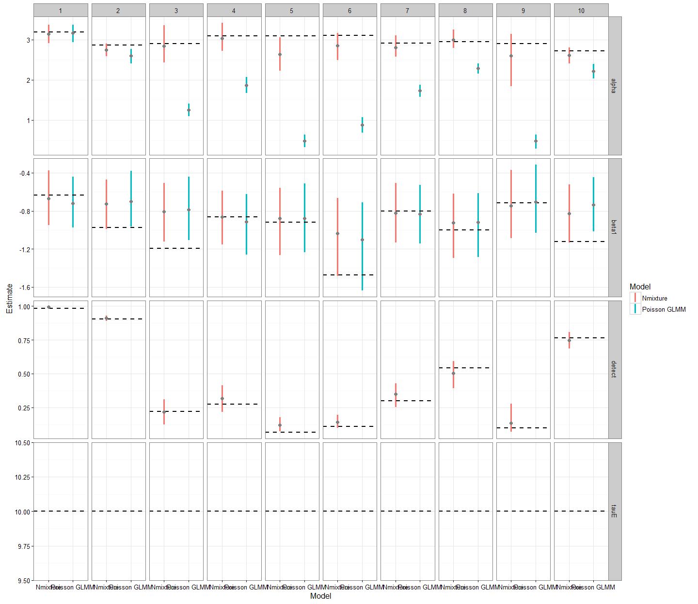

```r
#Hierarchical posteriors
hpars<-parsall %>% filter(par %in% c("beta1_mu","alpha_mu","alpha_sigma","beta1_sigma","tauE")) %>% group_by(Model,species,par) %>% summarize(mean=mean(estimate),lower=quantile(estimate,0.05),upper=quantile(estimate,0.95))

tr<-melt(data.frame(species=1:length(detection),beta1_mu=beta1_mu,alpha_mu=alpha_mu,beta1_sigma=beta1_sigma,alpha_sigma=alpha_sigma,tauE=tauE),id.var='species')
colnames(tr)<-c("species","par","value")

ggplot(hpars,aes(x=Model,ymin=lower,ymax=upper,y=mean,col=Model)) + geom_linerange(size=1.3) + facet_wrap(~par,scales="free",nrow=1) + geom_hline(data=tr,aes(yintercept=value),linetype='dashed',size=1,col="black") + geom_point(aes(y=mean),col='grey50',size=2) + theme_bw() + ylab("Estimate") 
```

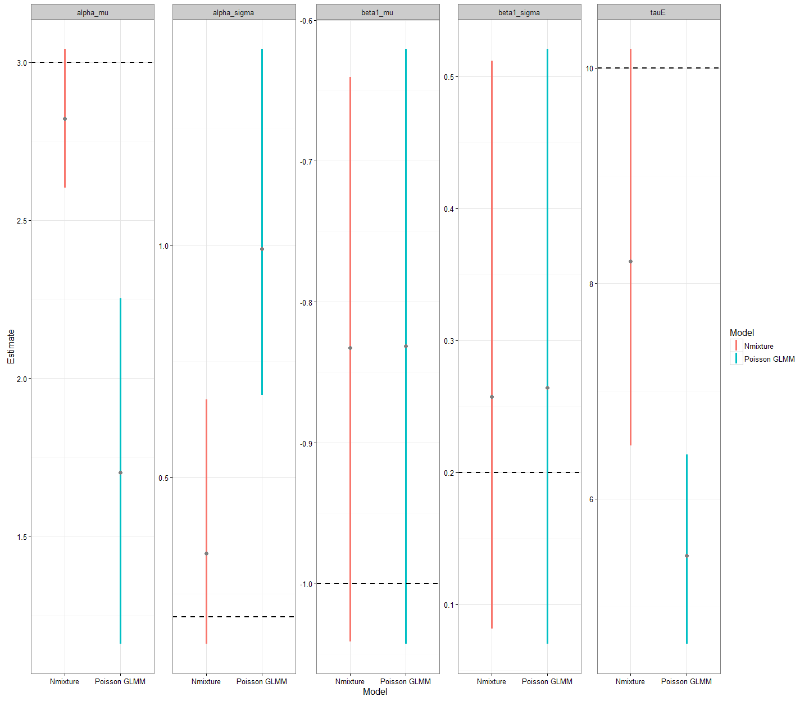

```r
#ggsave("Figures/StripPlots.svg",height=4,width=9)
```

##Correlation in posteriors for Nmixture Model


```r
castdf<- pars %>% filter(Model =="Nmixture") %>% group_by(Chain) %>% select(par,estimate,Draw) %>% filter(par %in% c("beta1_mu","alpha_mu")) %>% dcast(Chain+Draw~par,value.var="estimate")

pairs(castdf[,3:4],main="Correlation in Group-Level Posteriors")
```


```r
castdf<- pars %>% filter(Model =="Nmixture") %>% group_by(Chain) %>% select(par,estimate,Draw,species) %>% filter(par %in% c("alpha","beta1","detect","tauE")) %>% dcast(species+Chain+Draw~par,value.var="estimate")

pairs(castdf[,4:7],main="Correlation in Species-Level Posteriors")
```

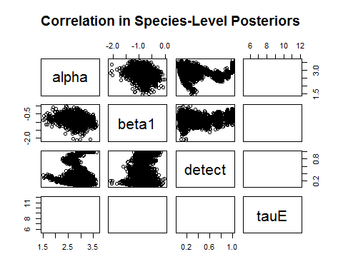

##Predicted Relationship 


```r
castdf<-dcast(pars[pars$par %in% c("beta1_mu","alpha_mu","tauE"),], Chain + Draw~par,value.var="estimate")
```

## Calculated predicted visitation rates

### Traits


```r
predy_trait<-trajF(alpha=castdf$alpha_mu,beta1=castdf$beta1_mu,tauSigma =1/sqrt(castdf$tauE),trait=as.numeric(traitmatch),resources=as.numeric(resources))
orig<-trajF(alpha=rnorm(1000,alpha_mu,alpha_sigma),beta1=rnorm(1000,beta1_mu,beta1_sigma),trait=as.numeric(traitmatch),resources=as.numeric(resources),tauSigma =1/sqrt(tauE))

pm<-melt(list(Nmixture=predy_trait,'Poisson GLMM'=predyniave_trait),id.vars=colnames(predy_trait))

tplot<-ggplot(data=pm[,],aes(x=trait)) + geom_ribbon(aes(ymin=lower,ymax=upper,fill=L1),alpha=0.5)  + geom_line(aes(y=mean,col=L1),size=.4,linetype="dashed") + theme_bw() + ylab("Daily Interactions") + xlab("Difference between Bill and Corolla Length") + geom_point(data=mdat,aes(x=traitmatch,y=Interactions),size=.5,alpha=.5) + labs(fill="Model",col="Model") + ggtitle("Simulation: Traits") + geom_line(data=orig,aes(y=mean),col='black',size=.8) + scale_fill_manual(values=c("grey70","Black"))+ scale_color_manual(values=c("grey70","Black"))
tplot
```


```r
ggsave("Figures/SimPredictBoth.jpg",height=5,width=7)
```

Black line is the true relationship. The red line is the posterior mean with confidible intervals in shaded grey for the proposed bayesian model. The blue line is the same model, but assuming perfect detection rates.

**Conclusion:** Accounting for detection and non-independence greatly increases the accuracy of the predicted state. The perfect detection model underestimates the strength of trait matching among hummingbirds and their foodplants.

##Posterior Predictive Check

Since I have simualted the data, it should fit as well as any random dataset drawn from the estimated parameters. An ideal fit would be posterior values sitting along the 1:1 line.


```r
fitstat<-droplevels(parsall[parsall$par %in% c("fit","fitnew"),])
fitstat<-dcast(fitstat,Draw+Chain+Model~par,value.var="estimate")

#add 1:1 line
ymin<-round(min(c(fitstat$fit,fitstat$fitnew)))
ymax<-round(max(c(fitstat$fit,fitstat$fitnew)))
ab<-data.frame(x=ymin:ymax,y=ymin:ymax)
p<-ggplot(fitstat,aes(x=fit,y=fitnew)) + geom_point(aes(col=Model)) + theme_bw() + coord_equal()
psim4<-p  + labs(x="Discrepancy of observed data",y="Discrepancy of replicated data",col="Model") + geom_line(data=ab,aes(x=x,y=y)) + ggtitle("Simulated Data")
psim4
```


```r
ggsave("Figures/SimulationDisc.jpeg",height=5,width=5)
```


```
## png 
##   2
```

#By species

#Compare using true known interactions

## No Detection Nmixture Model


```r
true_state<-obs.state %>% group_by(Bird,Plant) %>% summarize(n=sum(Yobs)) %>% acast(.$Bird~.$Plant)

N_niave<-pars_niave %>% filter(par== "ynew")

#Discrepancy function
#define discrep function
chisq<-function(o,e){(o-e)^2/(e+0.5)}

bydraw<-split(N_niave,list(N_niave$Chain,N_niave$Draw))

#Don't need giant matrix sitting around
rm(N_niave)
gc()
```

```
##            used  (Mb) gc trigger  (Mb) max used  (Mb)
## Ncells   705386  37.7    2487386 132.9  3655006 195.2
## Vcells 39069935 298.1   73733144 562.6 73686618 562.2
```

```r
occ_nodetect_matrix<-lapply(bydraw,function(x){
  r<-acast(x,species ~ plant,value.var = "estimate",fun.aggregate = sum)
})

rm(bydraw)
gc()
```

```
##            used  (Mb) gc trigger  (Mb) max used  (Mb)
## Ncells   693521  37.1    2487386 132.9  3655006 195.2
## Vcells 27938984 213.2   73733144 562.6 73686618 562.2
```

```r
#calculate discrep on those deviates
occ_nodetect<-lapply(occ_nodetect_matrix,function(r){
    #for each position what is the chisq
  rmerge<-matrix(nrow = nrow(true_state),ncol=ncol(true_state))
  for (x in 1:nrow(r)){
    for (y in 1:ncol(r)){
     rmerge[x,y]<-chisq(e=r[x,y],o=true_state[x,y])
      }
    }
  return(rmerge)
})

names(occ_nodetect)<-1:length(occ_nodetect)
names(occ_nodetect_matrix)<-1:length(occ_nodetect_matrix)
```

##With Detection


```r
Ndetect<-pars %>% filter(par== "ynew")
bydraw<-split(Ndetect,list(Ndetect$Chain,Ndetect$Draw))

#Don't need giant matrix around
rm(Ndetect)
gc()
```

```
##            used  (Mb) gc trigger  (Mb) max used  (Mb)
## Ncells   705448  37.7    2487386 132.9  3655006 195.2
## Vcells 33677399 257.0   73733144 562.6 73732686 562.6
```

```r
occ_matrix<-lapply(bydraw,function(x){
  r<-acast(x,species ~ plant,value.var = "estimate",fun.aggregate = sum)
  })

rm(bydraw)
gc()
```

```
##            used  (Mb) gc trigger  (Mb) max used  (Mb)
## Ncells   699476  37.4    2487386 132.9  3655006 195.2
## Vcells 28111936 214.5   73733144 562.6 73732686 562.6
```

```r
#calculate discrep for those aggregated matrices
occ<-lapply(occ_matrix,function(r){
    #for each position what is the chisq
  rmerge<-matrix(nrow = nrow(true_state),ncol=ncol(true_state))
  for (x in 1:nrow(r)){
    for (y in 1:ncol(r)){
     rmerge[x,y]<-chisq(e=r[x,y],o=true_state[x,y])
      }
    }
  return(rmerge)
})

names(occ)<-1:length(occ)
names(occ_matrix)<-1:length(occ_matrix)
```

##Compare to observed data


```r
#true number of observed interactions

mmat<-melt(true_state)
colnames(mmat)<-c("Bird","Plant","True_State")

#append to predicted matrices

#Nmixture with detection
mocc<-melt(occ_matrix)
colnames(mocc)<-c("Bird","Plant","Nmixture","Iteration")
simdat<-merge(mocc,mmat,by=c("Bird","Plant"),all.x=T)

#Nmixture with nodetection
moccd<-melt(occ_nodetect_matrix)
colnames(moccd)<-c("Bird","Plant","Poisson GLMM","Iteration")

simdat<-merge(simdat,moccd,by=c("Bird","Plant","Iteration"))

simdat<-melt(simdat,measure.vars = c("Nmixture","Poisson GLMM"))

ggplot(simdat,aes(x=True_State,y=value,col=variable),alpha=1) + geom_point() + geom_abline() + labs(col="Model") + ylab("Predicted State") + xlab("True State") + theme_bw() + facet_wrap(~variable)
```

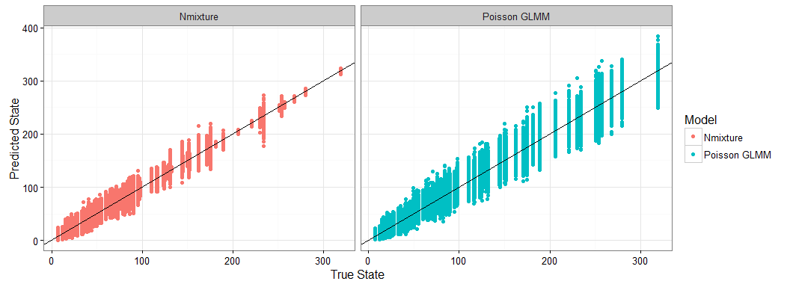

```r
ggsave("Figures/PredictedState.jpeg",height=3,width=8)

ggplot(simdat[simdat$variable %in% c("Nmixture","Poisson GLMM"),],aes(x=True_State,y=value,col=variable)) + geom_point(alpha=.3) + geom_abline() + labs(col="Model") + ylab("Predicted State") + xlab("True State") + theme_bw()
```

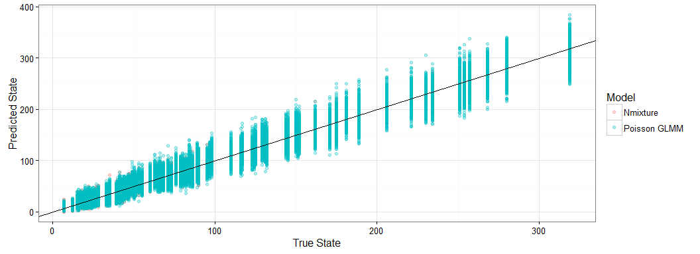

```r
ggsave("Figures/PredictedState_noM.jpeg",height=3,width=8)

#difference in the middle
simd<-dcast(simdat,...~variable)
simd$Diff<-simd$Nmixture-simd$`Poisson GLMM`
ggplot(simd,aes(x=True_State,y=abs(Diff))) + geom_point() + ylab("|Nmixture - Poisson GLMM|") + theme_bw() + labs(x="True State")
```


```r
ggsave("Figures/Difference_Pred.jpeg",height=4,width=6)
```

## View predicted trait-matching relationship with the number of visits.

```r
simdat<-merge(simdat,traitmelt,c("Bird","Plant"))
mmat<-merge(mmat,traitmelt,by=c("Bird","Plant"))
```

#Predicted total number of visits based on morphology


```r
simT<-simdat %>% group_by(variable,traitmatch) %>% summarize(Lower=quantile(value,0.05),Upper=quantile(value,0.95),y=mean(value))

ggplot(simT,aes(x=traitmatch)) + geom_ribbon(aes(ymin=Lower,ymax=Upper,fill=variable),alpha=0.4) + geom_line(aes(y=y,col=variable),linetype='dashed') + theme_bw()  + geom_point(data=mmat,aes(y=True_State)) + labs(x="Difference in Bill and Corolla Length",y="Total Predicted Visits",fill="Model",col='Model')
```

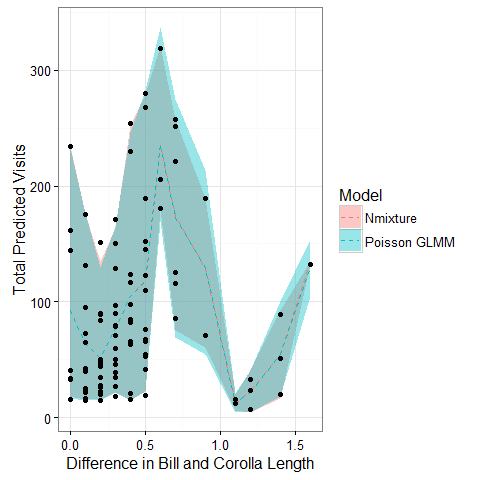

View a couple example data points from across the type of interactions.


```r
h<-simdat[which.max(simdat$True_State),c("Bird","Plant")]
d<-simdat[simdat$Bird %in% h$Bird & simdat$Plant %in% h$Plant,]

ggplot(data=d,aes(x=value,fill=variable))+ geom_histogram(position="identity") + labs(fill="Model") + geom_vline(aes(xintercept=True_State)) + ggtitle("High Visitation Example")
```


```r
h<-simdat[which.min(simdat$True_State),c("Bird","Plant")]
d<-simdat[simdat$Bird %in% h$Bird & simdat$Plant %in% h$Plant,]

ggplot(data=d,aes(x=value,fill=variable))+ geom_histogram(position="identity") + labs(fill="Model") + geom_vline(aes(xintercept=True_State)) + ggtitle("Low Visitation Example")
```

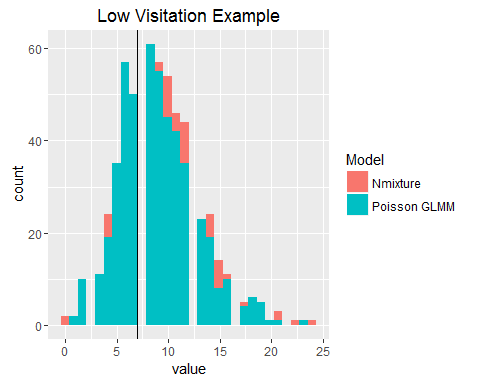

##Summary of discrepancy of predicted matrices


```r
#Nmixture without detection
occno_disc<-sapply(occ_nodetect,function(x) median(x))

#Nmixture with detection
occ_disc<-sapply(occ,function(x) median(x))

#compared to bayesian
ggplot() + xlab("Chi-squared Discrepancy") + geom_histogram(data=data.frame(occ_disc),aes(x=occ_disc),fill="red",alpha=.6) + theme_bw() +geom_vline(aes(xintercept=mean(occ_disc)),linetype="dashed",col="red") + geom_histogram(data=data.frame(occno_disc),aes(x=occno_disc),fill="orange",alpha=.6) + geom_vline(aes(xintercept=mean(occno_disc)),linetype="dashed",col="orange")
```

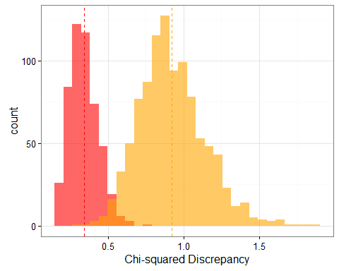

##Comparison of summary statistics


```r
d<-list(Nmixture=occ,Poisson_GLM=occ_nodetect)
d<-melt(d)
colnames(d)<-c("Bird","Plant","value","Iteration","Model")

d %>% group_by(Model,Iteration) %>% summarize(mean=mean(value),sd=sd(value),sum=sum(value)) %>% group_by(Model) %>% summarize(mean_mean=round(mean(mean),2),mean_sd=round(sd(mean),2),mean_sum=round(mean(sum),2))
```

```
## Source: local data frame [2 x 4]
## 
##         Model mean_mean mean_sd mean_sum
##         (chr)     (dbl)   (dbl)    (dbl)
## 1    Nmixture      1.14    0.21   114.29
## 2 Poisson_GLM      2.06    0.32   205.68
```


```r
save.image("AbundanceSimulation.RData")
```

