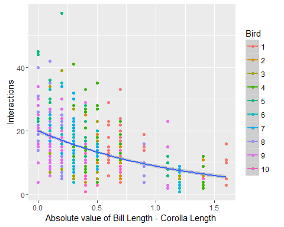
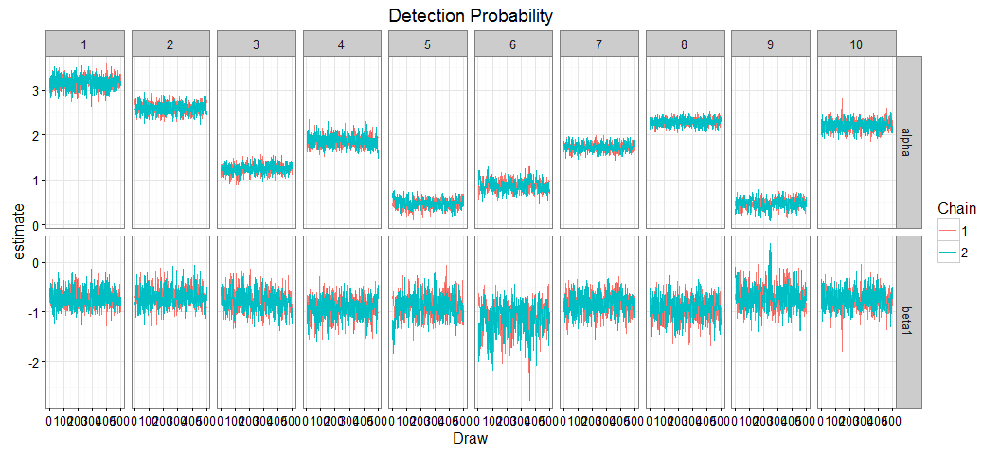
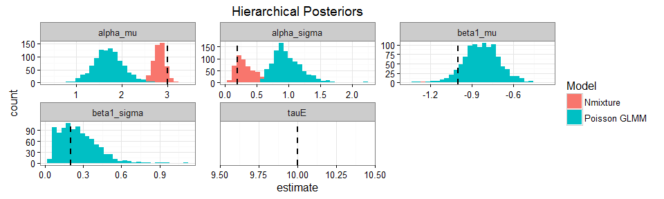
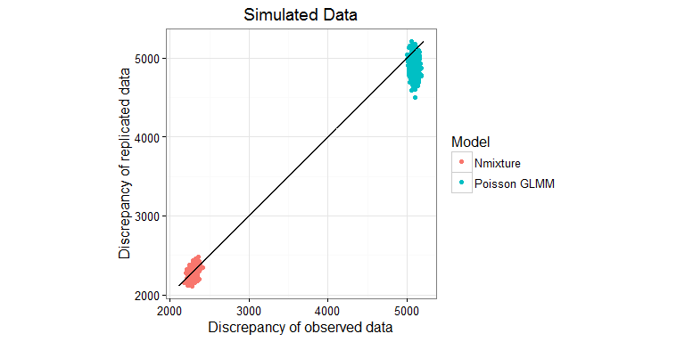
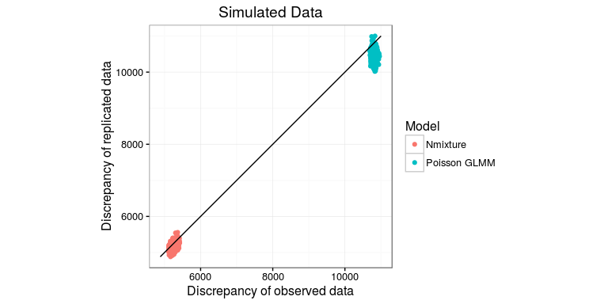
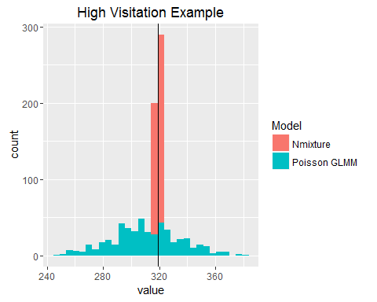
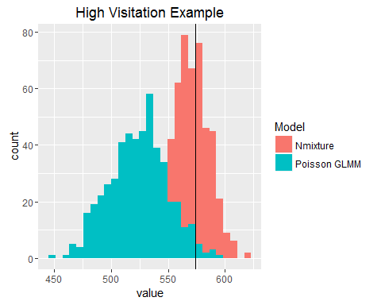
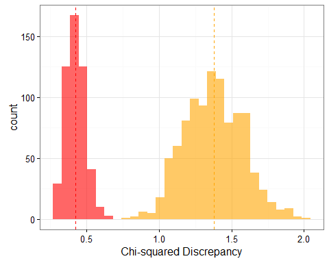
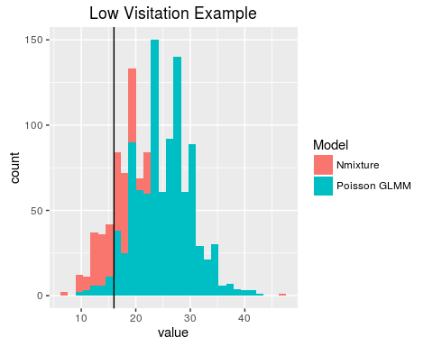
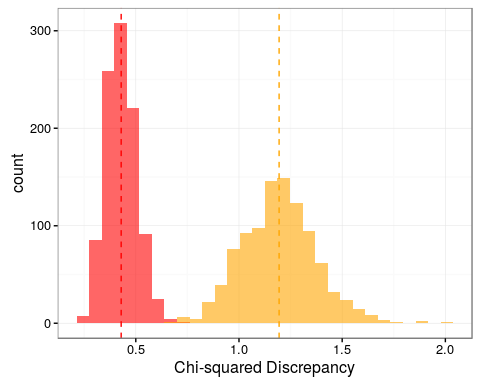

# Hierarchical Nmixture models for species interactions - Simulations
Ben Weinstein - Stony Brook University  


```
## [1] "Run Completed at 2016-04-15 16:26:27"
```

#Simulation   

## Parameters

* 10 hummingbird species
* 20 plant species
* Range of hummingbird bill sizes (in mm) ~ Pois(10)/10
* Range of corolla sizes (in mm) ~ Pois(15)/10
* Mean frequeny ($\lambda$) for each hummingbird is drawn from U(0,10)  
* Trait matching (minimizing Bill-Corolla difference) is drawn from a hierarcichal distribution
$$log(\lambda)<-\alpha_i + \beta_i *traitmatch$$
$$\alpha=N(3,0.2)$$
$$\beta1 = N(-1,0.2)$$
$$\beta2 = N(0.5,0.2)$$

* Imperfect detection 
* $$ p_i = U(0.1,0.9) $$ 
* 20 camera
* 3 days per camera

**View simulated strength and form of trait matching **


```r
load("Abundance.RData")
gc()
```

```
##            used  (Mb) gc trigger  (Mb) max used  (Mb)
## Ncells   562280  30.1     940480  50.3   750400  40.1
## Vcells 58687658 447.8   83462327 636.8 58700797 447.9
```

```r
source("Functions.R")
```

#Simulation Parameters


```r
#Number of hummingbird species
h_species=10
plant_species=20
cameras<-20
days<-3

#Bill sizes
Bill<-rpois(h_species,10)

#Corolla sizes
Corolla<-rpois(plant_species,15)

#Subtract both and take absolute value, convert cm
traitmatch<-abs(sapply(Corolla,function(x) x - Bill)/10)
  
#regression slopes
#traits
gamma1<- -1
#abundance
gamma2<- 0.2

#species variance in slopes
sigma_beta1<- 0.2
sigma_beta2<- 0.2

#Species intercept
intercept<- 3
sigma_alpha<- 0.2

detection= runif(h_species,0.1,0.9)
beta1<-rnorm(h_species,gamma1,sigma_beta1)
beta2<-rnorm(h_species,gamma2,sigma_beta2)
alpha<-rnorm(h_species,intercept,sigma_alpha)
```

#Compute resource abundance


```r
resources<-array(NA,dim=c(h_species,plant_species,cameras))

#fill for each month
for (x in 1:cameras){
   resources[,,x]<-rpois(1,10)   
  }
resources<-array(data=scale(resources),dim=c(h_species,plant_species,cameras))
```

#Compute true interaction matrices


```r
#for each species loop through and create a replicate dataframe
obs<-array(dim=c(h_species,plant_species,cameras,days))
lambda<-array(dim=c(h_species,plant_species,cameras))
N<-array(dim=c(h_species,plant_species,cameras))

#create intensities
for(x in 1:h_species){
  for (y in 1:plant_species){
    for (z in 1:cameras){
      lambda[x,y,z]<-exp(alpha[x] + beta1[x] * traitmatch[x,y]+beta2[x]*resources[x,y,z])
  }
  }
}


#draw latent states
for(x in 1:h_species){
  for (y in 1:plant_species){
    for (z in 1:cameras){
      # true latent count
      N[x,y,z]<-rpois(1,lambda[x,y,z])
    }
  }
}

#Observed counts in each day
for(x in 1:h_species){
  for (y in 1:plant_species){
    for (z in 1:cameras){
        for (d in 1:days){
      #true detection rate of that observed count
      obs[x,y,z,d]<-rbinom(1,N[x,y,z],p=detection[x])
      }
    }
  }
}
```

##View correlation in simulated latent state


```r
mdat<-melt(N)
colnames(mdat)<-c("Bird","Plant","Camera","Interactions")

traitmelt<-melt(traitmatch)
colnames(traitmelt)<-c("Bird","Plant","traitmatch")

mdat<-merge(mdat,traitmelt,c("Bird","Plant"))
ggplot(mdat,aes(x=traitmatch,y=Interactions,col=as.factor(Bird))) + geom_point() + geom_smooth(aes(group=1),method="glm",method.args = list(family = "poisson")) + labs(col="Bird") + xlab("Absolute value of Bill Length - Corolla Length ")
```



```r
#Merge resources
mr<-melt(resources)
colnames(mr)<-c("Bird","Plant","Camera","Abundance")
mdat<-merge(mdat,mr,by=c("Bird","Plant","Camera"))
```

##View Detection Rates


```r
obs.state<-melt(obs)
colnames(obs.state)<-c("Bird","Plant","Camera","Day","Yobs")
obs.state<-merge(mdat,obs.state,by=c("Bird","Plant","Camera"))
ggplot(obs.state,aes(x=Interactions,y=Yobs,col=Camera)) + geom_point() + theme_bw() + geom_abline() + coord_equal()
```


# Hierarcichal Nmixture Model

For hummingbird i visiting plant j recorded by camera k on day d:

$$ Y_{i,j,k,d} \sim Binom(N_{i,j,k},\omega_i)$$
$$N_{i,j,k} \sim Pois(\lambda_{i,j}) $$
$$log(\lambda_{i,j})<-\alpha_i + \beta_{1,i} * |Bill_i - Corolla_j| * \beta_{2,i} * Abundance_{j,k}$$

**Priors**

Please recall that jags parameterizes models using precision, not sd (precision = 1/sd^2)

$$\omega_i \sim (\mu_{\omega},\tau_{\omega})$$  $$\mu_{\omega} \sim Normal(0,0.5)   
$$\tau_{\omega} \sim Uniform(0,10)

$$\alpha_i \sim Normal(\mu_{\alpha},\tau_{\alpha})$$
$$\beta_{i,1} \sim Normal(\mu_{\beta_1},\tau_{\beta_1})$$

**Hyperpriors**
$$\mu_{\alpha} \sim Normal(0,0.0001)$$
$$\mu_{\beta_1} \sim Normal(0,0.0001)$$
$$\mu_{\beta_2} \sim Normal(0,0.0001)$$

$$\tau_{\alpha} \sim Half-T(0.0001,0.0001)$$
$$\sigma_{\alpha} = \sqrt[2]{\frac{1}{\tau_\alpha}}$$

$$\tau_{\beta_1} \sim \sqrt[2]{\frac{1}{\sigma_\{beta_1}}}$$
$$\sigma_{\beta_1} \sim Half-T(0,1)$$

$$\tau_{\beta_2} \sim \sqrt[2]{\frac{1}{\sigma_{\beta_2}}}$$
$$\sigma_{\beta_2} \sim Half-T(0,1)$$


#Simulated data without detection


```r
runs<-10000

#trigger parallel
paralleljags<-T

#Source model
source("Bayesian/NoDetectNmixturePoissonRagged.R")

#print model
print.noquote(readLines("Bayesian//NoDetectNmixturePoissonRagged.R"))

if(paralleljags){

  #for parallel run
  Yobs=obs.state$Yobs
  Bird=obs.state$Bird
  Plant=obs.state$Plant
  Plants=max(obs.state$Plant)
  Cameras=max(obs.state$Camera)
  Camera=obs.state$Camera
  Traitmatch=traitmatch
  Birds=max(obs.state$Bird)
  Nobs=length(obs.state$Yobs)
  resources=resources

  #Inits
  InitStage <- function(){list(beta1=rep(0.5,Birds),alpha=rep(0.5,Birds),intercept=0,sigma_alpha=0.1,sigma_beta1=0.1,sigma_beta2=0.1,gamma1=0,gamma2=0)}
  
  #Parameters to track
  ParsStage <- c("alpha","beta1","beta2","intercept","sigma_alpha","sigma_beta1","sigma_beta2","ynew","gamma1","gamma2","fit","fitnew")
  
  #MCMC options
  ni <- runs  # number of draws from the posterior
  nt <- 5   #thinning rate
  nb <- runs*.95 # number to discard for burn-in
  nc <- 2  # number of chains

  Dat<-list("Yobs","Bird","Plant","Plants","Traitmatch","Birds","Nobs","Cameras","Camera","resources")

    sim_niave<-do.call(jags.parallel,list(data=Dat,inits=InitStage,ParsStage,model.file="Bayesian/NoDetectNmixturePoissonRagged.jags",n.thin=nt, n.iter=ni,n.burnin=nb,n.chains=nc))
    
  } else {
 #Input Data
  Dat <- list(
    Yobs=obs.state$Yobs,
    Bird=obs.state$Bird,
    Plant=obs.state$Plant,
    Plants=max(obs.state$Plant),
    Traitmatch=traitmatch,
    Cameras=max(obs.state$Camera),
    Camera=obs.state$Camera,
    Birds=max(obs.state$Bird),
    Nobs=length(obs.state$Yobs),
    resources=resources)

    #Inits
  InitStage <- function() {list(beta1=rep(0.5,Dat$Birds),beta2=rep(0.5,Dat$Birds),alpha=rep(0.5,Dat$Birds),intercept=0,sigma_alpha=0.1,sigma_beta1=0.1,sigma_beta2=0.1,gamma1=0,gamma2=0)}
  
  #Parameters to track
  ParsStage <- c("alpha","beta1","beta2","intercept","sigma_alpha","sigma_beta1","sigma_beta2","ynew","gamma1","gamma2","fit","fitnew")
  
  #MCMC options
  ni <- runs  # number of draws from the posterior
  nt <- 5   #thinning rate
  nb <- runs*.95 # number to discard for burn-in
  nc <- 2  # number of chains
  
  #Jags
  
  sim_niave <- jags(inits=InitStage,
                   n.chains=nc, model.file="Bayesian/NoDetectNmixturePoissonRagged.jags",
                   working.directory=getwd(),
                   data=Dat,
                   parameters.to.save=ParsStage,
                   n.thin=nt,
                   n.iter=ni,
                   n.burnin=nb,
                   DIC=F)
}
```


```r
#recompile if needed
load.module("dic")
runs<-5000
recompile(sim_niave)
```

```
## Compiling model graph
##    Resolving undeclared variables
##    Allocating nodes
##    Graph Size: 117601
## 
## Initializing model
## 
## Compiling model graph
##    Resolving undeclared variables
##    Allocating nodes
##    Graph Size: 117601
## 
## Initializing model
```

```r
sim_niave<-update(sim_niave,n.iter=runs,n.burnin=runs*.95,n.thin=10)
```


```r
gc()
```

```
##            used  (Mb) gc trigger   (Mb)  max used   (Mb)
## Ncells   651254  34.8    1168576   62.5   1168576   62.5
## Vcells 87679164 669.0  173496920 1323.7 156839617 1196.6
```

```r
pars_niave<-extract_par(sim_niave,data=obs.state)
pars_niave$Model<-c("Poisson GLMM")
```

##Assess Convergence


```r
ggplot(pars_niave[pars_niave$par %in% c("alpha","beta1","beta2"),],aes(x=Draw,y=estimate,col=as.factor(Chain))) + geom_line() + facet_grid(par~species,scale="free") + theme_bw() + labs(col="Chain") + ggtitle("Detection Probability")
```




```r
ggplot(pars_niave[pars_niave$par %in% c("gamma1","gamma2","sigma_alpha","sigma_beta1","sigma_beta2"),],aes(x=Draw,y=estimate,col=as.factor(Chain))) + geom_line() + theme_bw() + labs(col="Chain") + ggtitle("Trait-matching regression") + facet_wrap(~par,scales="free")
```


##Posteriors


```r
###Posterior Distributions
p<-ggplot(pars_niave[pars_niave$par %in% c("alpha","beta1","beta2"),],aes(x=estimate)) + geom_histogram() + ggtitle("Estimate of parameters") + facet_grid(species~par,scales="free") + theme_bw() + ggtitle("Species Posteriors")

#Add true values
tr<-melt(data.frame(species=1:length(detection),alpha=alpha,beta1=beta1,beta2=beta2),id.var='species')
colnames(tr)<-c("species","par","value")
psim<-p + geom_vline(data=tr,aes(xintercept=value),col='red',linetype='dashed',size=1)
psim
```


```r
ggsave("Figures/SimulationPosteriorsNoDetect.jpg",dpi=300,height=8,width=8)
```


```r
p<-ggplot(pars_niave[pars_niave$par %in% c("gamma1","gamma2","intercept","sigma_alpha","sigma_beta1","sigma_beta2"),],aes(x=estimate)) + geom_histogram() + ggtitle("Hierarchical Posteriors") + facet_grid(~par,scale="free") + theme_bw()

#Add true values
tr<-melt(list(gamma1=gamma1,gamma2=gamma2,intercept=intercept,sigma_alpha=sigma_alpha,sigma_beta1=sigma_beta1,sigma_beta2=sigma_beta2))

colnames(tr)<-c("value","par")

psim2<-p + geom_vline(data=tr,aes(xintercept=value),linetype='dashed',size=1,col="red")
```

**True values are given in the dashed lines.**

##Predicted Relationship 


```r
castdf<-group_by(pars_niave,Chain) %>% select(par,estimate) %>% filter(par %in% c("gamma1","gamma2","intercept"))

castdf<-dcast(pars_niave[pars_niave$par %in% c("gamma1","gamma2","intercept"),], Chain + Draw~par,value.var="estimate")

#calculated predicted y
predyniave_trait<-trajF(alpha=castdf$intercept,beta1=castdf$gamma1,beta2=0,x=as.numeric(traitmatch),resources=as.numeric(resources[,1,]))

predyniave_abundance<-trajA(alpha=castdf$intercept,beta1=0,beta2=castdf$gamma2,x=as.numeric(traitmatch),resources=as.numeric(resources[,1,]))


predyniave_both<-trajF(alpha=castdf$intercept,beta1=castdf$gamma1,beta2=castdf$gamma2,x=as.numeric(traitmatch),resources=as.numeric(resources[,1,]))
```

# Simulated data with detection


```r
runs<-15000

#trigger parallel
paralleljags<-T

#Source model
source("Bayesian/NmixturePoissonRagged.R")

#print model
print.noquote(readLines("Bayesian//NmixturePoissonRagged.R"))

if(paralleljags){

  #for parallel run
  Yobs=obs.state$Yobs
  Bird=obs.state$Bird
  Plant=obs.state$Plant
  Camera=obs.state$Camera
  Cameras=max(obs.state$Camera)
  Traitmatch=traitmatch
  Birds=max(obs.state$Bird)
  Plants=max(obs.state$Plant)
  Nobs=length(obs.state$Yobs)
  resources=resources

  #A blank Y matrix - all present
  Ninit<-array(dim=c(h_species,plant_species,cameras),data=max(obs.state$Yobs)+1)

  #Inits
  InitStage <- function() {list(beta1=rep(0.5,Birds),beta2=rep(0.5,Birds),alpha=rep(0.5,Birds),dtrans=rep(0,Birds),intercept=0,sigma_alpha=0.1,sigma_beta1=0.1,sigma_beta2=0.1,N=Ninit,gamma1=0,gamma2=0)}
  
  #Parameters to track
  ParsStage <- c("detect","alpha","beta1","beta2","intercept","sigma_alpha","sigma_beta1","sigma_beta2","ynew","gamma1","gamma2","fit","fitnew")
  
  #MCMC options
  ni <- runs  # number of draws from the posterior
  nt <- 5   #thinning rate
  nb <- runs*.95 # number to discard for burn-in
  nc <- 2  # number of chains

  Dat<-list("Yobs","Bird","Plant","Plants","Traitmatch","resources","Birds","Nobs","Ninit","Camera","Cameras")

    system.time(sim_detect<-do.call(jags.parallel,list(Dat,InitStage,ParsStage,model.file="Bayesian/NmixturePoissonRagged.jags",n.thin=nt, n.iter=ni,n.burnin=nb,n.chains=nc)))
  } else {
  #Input Data
  Dat <- list(
    Yobs=obs.state$Yobs,
    Bird=obs.state$Bird,
    Plant=obs.state$Plant,
    Camera=obs.state$Camera,
    Cameras=max(obs.state$Camera),
    Traitmatch=traitmatch,
    resources=resources,
    Birds=max(obs.state$Bird),
    Plants=max(obs.state$Plant),
    Nobs=length(obs.state$Yobs)
  )
    #A blank Y matrix - all present
  Ninit<-array(dim=c(h_species,plant_species,cameras),data=max(obs.state$Yobs)+1)
  
  #Inits
  InitStage <- function() {list(beta1=rep(0.5,Dat$Birds),beta2=rep(0.5,Dat$Birds),alpha=rep(0.5,Dat$Birds),dtrans=rep(0,Dat$Birds),intercept=0,sigma_alpha=0.1,sigma_beta1=0.1,sigma_beta2=0.1,N=Ninit,gamma1=0,gamma2=0)}
  
  #Parameters to track
  ParsStage <- c("detect","alpha","beta1","beta2","intercept","sigma_alpha","sigma_beta2","sigma_beta1","ynew","gamma1","gamma2","fit","fitnew")
  
  #MCMC options
  ni <- runs  # number of draws from the posterior
  nt <- 5   #thinning rate
  nb <- runs*.95 # number to discard for burn-in
  nc <- 2  # number of chains
  
  #Jags
  
  system.time(sim_detect <- jags(inits=InitStage,
                   n.chains=nc, model.file="Bayesian/NmixturePoissonRagged.jags",
                   working.directory=getwd(),
                   data=Dat,
                   parameters.to.save=ParsStage,
                   n.thin=nt,
                   n.iter=ni,
                   n.burnin=nb,
                   DIC=F))
}
```


```r
#recompile if needed
load.module("dic")
runs<-5000
recompile(sim_detect)
```

```
## Compiling model graph
##    Resolving undeclared variables
##    Allocating nodes
##    Graph Size: 143389
## 
## Initializing model
## 
## Compiling model graph
##    Resolving undeclared variables
##    Allocating nodes
##    Graph Size: 143389
## 
## Initializing model
```

```r
  ParsStage <- c("detect","alpha","beta1","beta2","intercept","sigma_alpha","sigma_beta2","sigma_beta1","ynew","gamma1","gamma2","fit","fitnew")
system.time(sim_detect<-update(sim_detect,n.iter=runs,n.burnin=runs*.95,n.thin=10,parameters.to.save=ParsStage))
```

```
##    user  system elapsed 
## 876.196  80.753 870.715
```


```r
pars<-extract_par(sim_detect,data=obs.state)
pars$Model<-"Nmixture"
```

##Assess Convergence


```r
ggplot(pars[pars$par %in% c("detect","alpha","beta1","beta2"),],aes(x=Draw,y=estimate,col=as.factor(Chain))) + geom_line() + facet_grid(par~species,scale="free") + theme_bw() + labs(col="Chain") + ggtitle("Detection Probability")
```


```r
ggplot(pars[pars$par %in% c("gamma1","sigma_alpha","sigma_beta1","gamma2","sigma_beta2"),],aes(x=Draw,y=estimate,col=as.factor(Chain))) + geom_line() + theme_bw() + labs(col="Chain") + ggtitle("Trait-matching regression") + facet_wrap(~par,scales="free")
```


##Posteriors


```r
###Posterior Distributions
p<-ggplot(pars[pars$par %in% c("detect","alpha","beta1","beta2"),],aes(x=estimate)) + geom_histogram() + ggtitle("Estimate of parameters") + facet_grid(species~par,scales="free") + theme_bw() + ggtitle("Species Posteriors")

#Add true values
tr<-melt(data.frame(species=1:length(detection),detect=detection,alpha=alpha,beta1=beta1,beta2=beta2),id.var='species')
colnames(tr)<-c("species","par","value")
psim<-p + geom_vline(data=tr,aes(xintercept=value),col='red',linetype='dashed',size=1)
#ggsave("Figures/SimulationPosteriors.jpg",dpi=300,height=8,width=8)
```


```r
p<-ggplot(pars[pars$par %in% c("gamma1","gamma2","intercept","sigma_alpha","sigma_beta1","sigma_beta2"),],aes(x=estimate)) + geom_histogram() + ggtitle("Hierarchical Posteriors") + facet_wrap(~par,scale="free",nrow=2) + theme_bw() 

#Add true values
tr<-melt(list(gamma1=gamma1,gamma2=gamma2,intercept=intercept,sigma_alpha=sigma_alpha,sigma_beta1=sigma_beta1,sigma_beta2=sigma_beta2))

colnames(tr)<-c("value","par")

psim2<-p + geom_vline(data=tr,aes(xintercept=value),linetype='dashed',size=1,col="black")
#ggsave("Figures/SimulationH.jpg",dpi=300,height=4,width=10)
```

**True values are given in the dashed lines.**

##Compare simulation posteriors with and without detection


```r
#Bind to other dataset
parsall<-rbind.data.frame(pars[!pars$par %in% "ynew",],pars_niave[!pars_niave$par %in% "ynew",])
parsall$Model<-as.factor(parsall$Model)

###Posterior Distributions
p<-ggplot(parsall[parsall$par %in% c("detect","alpha","beta1","beta2"),],aes(x=estimate,fill=Model)) + geom_histogram(position="identity") + ggtitle("Estimate of parameters") + facet_grid(species~par,scales="free") + theme_bw() 

#Add true values
tr<-melt(data.frame(species=1:length(detection),detect=detection,alpha=alpha,beta1=beta1,beta2=beta2),id.var='species')
colnames(tr)<-c("species","par","value")
psim<-p + geom_vline(data=tr,aes(xintercept=value),col='black',linetype='dashed',size=1)
psim
```


```r
#ggsave("Figures/SimulationPosteriorsBoth.jpg",dpi=300,height=8,width=8)
```


```r
p<-ggplot(parsall[parsall$par %in% c("gamma1","gamma2","intercept","sigma_alpha","sigma_beta1","sigma_beta2"),],aes(x=estimate,fill=Model)) + geom_histogram(position="identity") + ggtitle("Hierarchical Posteriors") + facet_wrap(~par,scale="free",nrow=2) + theme_bw() 

#Add true values
tr<-melt(list(gamma1=gamma1,gamma2=gamma2,intercept=intercept,sigma_alpha=sigma_alpha,sigma_beta1=sigma_beta1,sigma_beta2=sigma_beta2))

colnames(tr)<-c("value","par")

psim2<-p + geom_vline(data=tr,aes(xintercept=value),linetype='dashed',size=1,col="black")
psim2
```



```r
#ggsave("Figures/SimulationHBoth.jpg",dpi=300,height=4,width=10)
```

##Strip plots
Plot the posterior mean density

```r
spars<-parsall %>% filter(par %in% c("alpha","beta1","beta2","detect")) %>% group_by(Model,species,par) %>% summarize(mean=mean(estimate),lower=quantile(estimate,0.05),upper=quantile(estimate,0.95))

tr<-melt(data.frame(species=1:length(detection),detect=detection,alpha=alpha,beta1=beta1,beta2=beta2),id.var='species')
colnames(tr)<-c("species","par","value")

ggplot(spars,aes(x=Model,ymin=lower,ymax=upper,y=mean,col=Model)) + geom_linerange(size=1.3) + facet_grid(par~species,scales="free") + geom_hline(data=tr,aes(yintercept=value),linetype='dashed',size=1,col="black") + geom_point(aes(y=mean),col='grey50',size=2) + theme_bw() + ylab("Estimate")
```


```r
#Hierarchical posteriors
hpars<-parsall %>% filter(par %in% c("gamma1","gamma2","intercept","sigma_alpha","sigma_beta1","sigma_beta2")) %>% group_by(Model,species,par) %>% summarize(mean=mean(estimate),lower=quantile(estimate,0.05),upper=quantile(estimate,0.95))

tr<-melt(data.frame(species=1:length(detection),gamma1=gamma1,gamma2=gamma2,intercept=intercept,sigma_beta1=sigma_beta1,sigma_beta2=sigma_beta2,sigma_alpha=sigma_alpha),id.var='species')
colnames(tr)<-c("species","par","value")

ggplot(hpars,aes(x=Model,ymin=lower,ymax=upper,y=mean,col=Model)) + geom_linerange(size=1.3) + facet_wrap(~par,scales="free",nrow=1) + geom_hline(data=tr,aes(yintercept=value),linetype='dashed',size=1,col="black") + geom_point(aes(y=mean),col='grey50',size=2) + theme_bw() + ylab("Estimate")
```


```r
#ggsave("Figures/StripPlots.svg",height=4,width=9)
```

##Correlation in posteriors for Nmixture Model


```r
castdf<- pars %>% filter(Model =="Nmixture") %>% group_by(Chain) %>% select(par,estimate,Draw) %>% filter(par %in% c("gamma1","gamma2","intercept")) %>% dcast(Chain+Draw~par,value.var="estimate")
head(castdf)
```

```
##   Chain Draw     gamma1      gamma2 intercept
## 1     1    1 -0.9413635 -0.01729438  3.012204
## 2     1    2 -1.1062892  0.16665583  2.831196
## 3     1    3 -1.0678374  0.06154857  2.967698
## 4     1    4 -1.2039975  0.16993761  2.934343
## 5     1    5 -1.0144020  0.10076162  3.112009
## 6     1    6 -1.0529783  0.16211198  3.000502
```

```r
ggpairs(castdf[,3:4],title="Correlation in Group-Level Posteriors")
```


```r
castdf<- pars %>% filter(Model =="Nmixture") %>% group_by(Chain) %>% select(par,estimate,Draw,species) %>% filter(par %in% c("alpha","beta1","beta2","detect")) %>% dcast(species+Chain+Draw~par,value.var="estimate")
head(castdf)
```

```
##   species Chain Draw    alpha      beta1     beta2    detect
## 1       1     1    1 3.142077 -0.7086160 0.2782037 0.5099075
## 2       1     1    2 3.151607 -0.7292582 0.2993238 0.5105661
## 3       1     1    3 3.124956 -0.6753985 0.2572929 0.5108333
## 4       1     1    4 3.117961 -0.6964519 0.2648271 0.5327701
## 5       1     1    5 3.087680 -0.6540706 0.2718246 0.5239472
## 6       1     1    6 3.091368 -0.6579279 0.2905445 0.5102669
```

```r
ggpairs(castdf[,4:6],title="Correlation in Species-Level Posteriors")
```


##Predicted Relationship 


```r
castdf<-dcast(pars[pars$par %in% c("gamma1","gamma2","intercept"),], Chain + Draw~par,value.var="estimate")
```

## Calculated predicted visitation rates

### Traits


```r
predy_trait<-trajF(alpha=castdf$intercept,beta1=castdf$gamma1,x=as.numeric(traitmatch),resources=as.numeric(resources),beta2=0)
orig<-trajF(alpha=rnorm(2000,intercept,sigma_alpha),beta1=rnorm(2000,gamma1,sigma_beta1),beta2=0,x=as.numeric(traitmatch),resources=as.numeric(resources))

pm<-melt(list(Nmixture=predy_trait,'Poisson GLMM'=predyniave_trait),id.vars=colnames(predy_trait))

tplot<-ggplot(data=pm,aes(x=x)) + geom_ribbon(aes(ymin=lower,ymax=upper,fill=L1),alpha=0.3)  + geom_line(aes(y=mean,col=L1),size=.4,linetype="dashed") + theme_bw() + ylab("Daily Interactions") + xlab("Difference between Bill and Corolla Length") + geom_point(data=mdat,aes(x=traitmatch,y=Interactions),size=.5,alpha=.5) + labs(fill="Model",col="Model") + ggtitle("Traits") + theme(legend.position='none')+ geom_line(data=orig,aes(y=mean),col='black',size=.8)
```

###Abundance


```r
predy_abundance<-trajA(alpha=castdf$intercept,beta1=0,x=as.numeric(traitmatch),resources=as.numeric(resources),beta2=castdf$gamma2)

orig<-trajA(alpha=rnorm(1000,intercept,sigma_alpha),beta1=0,beta2=rnorm(1000,gamma2,sigma_beta1),x=as.numeric(traitmatch),resources=as.numeric(resources))

pm<-melt(list(Nmixture=predy_abundance,'Poisson GLMM'=predyniave_abundance),id.vars=colnames(predy_abundance))

aplot<-ggplot(data=pm,aes(x=x)) + geom_ribbon(aes(ymin=lower,ymax=upper,fill=L1),alpha=0.3)  + geom_line(aes(y=mean,col=L1),size=.4,linetype="dashed") + theme_bw() + ylab("Daily Interactions") + xlab("Flower Abundance") + geom_line(data=orig,aes(y=mean),col='black',size=.8) + geom_point(data=mdat,aes(x=Abundance,y=Interactions),size=.5,alpha=.5) + labs(fill="Model") + ggtitle("Abundance") + theme(legend.position='none')
```


```r
predy<-trajF(alpha=castdf$intercept,beta1=castdf$gamma1,x=as.numeric(traitmatch),resources=as.numeric(resources),beta2=castdf$gamma2)

orig<-trajF(alpha=rnorm(1000,intercept,sigma_alpha),beta1=rnorm(1000,gamma1,sigma_beta1),beta2=rnorm(1000,gamma2,sigma_beta2),x=as.numeric(traitmatch),resources=as.numeric(resources))

pm<-melt(list(Nmixture=predy,'Poisson GLMM'=predyniave_both),id.vars=colnames(predy))

fplot<-ggplot(data=pm,aes(x=x)) + geom_ribbon(aes(ymin=lower,ymax=upper,fill=L1),alpha=0.3)  + geom_line(aes(y=mean,col=L1),size=.4,linetype="dashed") + theme_bw() + ylab("Daily Interactions") + xlab("Difference between Bill and Corolla Length") + geom_point(data=mdat,aes(x=traitmatch,y=Interactions),size=.5,alpha=.5) + labs(fill="Model",col="Model") + ggtitle("Traits+Abundance")+ geom_line(data=orig,aes(y=mean),col='black',size=.8)
```


```r
grid.arrange(fplot,aplot,tplot, layout_matrix = cbind(c(2,3,3),c(1,1,1) ))
```



```r
jpeg("Figures/SimPredictBoth.jpg",height=6,width=7,units="in",res=300)
grid.arrange(fplot,aplot,tplot, layout_matrix = cbind(c(2,3,3),c(1,1,1) ))
dev.off()
```

```
## png 
##   2
```

Black line is the true relationship. The red line is the posterior mean with confidible intervals in shaded grey for the proposed bayesian model. The blue line is the same model, but assuming perfect detection rates.

**Conclusion:** Accounting for detection and non-independence greatly increases the accuracy of the predicted state. The perfect detection model underestimates the strength of trait matching among hummingbirds and their foodplants.

##Posterior Predictive Check

Since I have simualted the data, it should fit as well as any random dataset drawn from the estimated parameters. An ideal fit would be posterior values sitting along the 1:1 line.


```r
fitstat<-droplevels(parsall[parsall$par %in% c("fit","fitnew"),])
fitstat<-dcast(fitstat,Draw+Chain+Model~par,value.var="estimate")

#add 1:1 line
ymin<-round(min(c(fitstat$fit,fitstat$fitnew)))
ymax<-round(max(c(fitstat$fit,fitstat$fitnew)))
ab<-data.frame(x=ymin:ymax,y=ymin:ymax)
p<-ggplot(fitstat,aes(x=fit,y=fitnew)) + geom_point(aes(col=Model)) + theme_bw() + coord_equal()
psim4<-p  + labs(x="Discrepancy of observed data",y="Discrepancy of replicated data",col="Model") + geom_line(data=ab,aes(x=x,y=y)) + ggtitle("Simulated Data")
psim4
```



```r
ggsave("Figures/SimulationDisc.jpeg",height=5,width=5)
```


```
## png 
##   2
```


#Compare using true known interactions

## No Detection Nmixture Model


```r
#Discrepancy function
#define discrep function
chisq<-function(o,e){(o-e)^2/(e+0.5)}

N_niave<-pars_niave[ pars_niave$par %in% "ynew",]

bydraw<-split(N_niave,list(N_niave$Chain,N_niave$Draw))

#Don't need giant matrix sitting around
rm(N_niave)
gc()
```

```
##             used   (Mb) gc trigger   (Mb)  max used   (Mb)
## Ncells    703368   37.6    1770749   94.6   1770749   94.6
## Vcells 300058664 2289.3  532944965 4066.1 444053190 3387.9
```

```r
occ_nodetect_matrix<-lapply(bydraw,function(x){
  r<-acast(x,species ~ plant,value.var = "estimate",fun.aggregate = sum)
})

rm(bydraw)
gc()
```

```
##             used   (Mb) gc trigger   (Mb)  max used   (Mb)
## Ncells    694180   37.1    1770749   94.6   1770749   94.6
## Vcells 222241517 1695.6  532944965 4066.1 444053190 3387.9
```

```r
#calculate discrep on those deviates
occ_nodetect<-lapply(occ_nodetect_matrix,function(r){
    #for each position what is the chisq
  rmerge<-matrix(nrow = nrow(true_state),ncol=ncol(true_state))
  for (x in 1:nrow(r)){
    for (y in 1:ncol(r)){
     rmerge[x,y]<-chisq(e=r[x,y],o=true_state[x,y])
      }
    }
  return(rmerge)
})

names(occ_nodetect)<-1:length(occ_nodetect)
names(occ_nodetect_matrix)<-1:length(occ_nodetect_matrix)
```

##With Detection


```r
Ndetect<-pars %>% filter(par== "ynew")
bydraw<-split(Ndetect,list(Ndetect$Chain,Ndetect$Draw))

#Don't need giant matrix around
rm(Ndetect)
gc()
```

```
##             used   (Mb) gc trigger   (Mb)  max used   (Mb)
## Ncells    712236   38.1    1770749   94.6   1770749   94.6
## Vcells 300416529 2292.0  532944965 4066.1 532941228 4066.1
```

```r
occ_matrix<-lapply(bydraw,function(x){
  r<-acast(x,species ~ plant,value.var = "estimate",fun.aggregate = sum)
  })

rm(bydraw)
gc()
```

```
##             used   (Mb) gc trigger   (Mb)  max used   (Mb)
## Ncells    702160   37.5    1770749   94.6   1770749   94.6
## Vcells 222575268 1698.2  532944965 4066.1 532941228 4066.1
```

```r
#calculate discrep for those aggregated matrices
occ<-lapply(occ_matrix,function(r){
    #for each position what is the chisq
  rmerge<-matrix(nrow = nrow(true_state),ncol=ncol(true_state))
  for (x in 1:nrow(r)){
    for (y in 1:ncol(r)){
     rmerge[x,y]<-chisq(e=r[x,y],o=true_state[x,y])
      }
    }
  return(rmerge)
})

names(occ)<-1:length(occ)
names(occ_matrix)<-1:length(occ_matrix)
```

##Compare to observed data


```r
#true number of observed interactions
true_state<-obs.state %>% group_by(Bird,Plant) %>% summarize(n=sum(Yobs)) %>% acast(.$Bird~.$Plant)


mmat<-melt(true_state)
colnames(mmat)<-c("Bird","Plant","True_State")

#append to predicted matrices

#Nmixture with detection
mocc<-melt(occ_matrix)
colnames(mocc)<-c("Bird","Plant","Nmixture","Iteration")
simdat<-merge(mocc,mmat,by=c("Bird","Plant"),all.x=T)

#Nmixture with nodetection
moccd<-melt(occ_nodetect_matrix)
colnames(moccd)<-c("Bird","Plant","Poisson GLMM","Iteration")

simdat<-merge(simdat,moccd,by=c("Bird","Plant","Iteration"))

simdat<-melt(simdat,measure.vars = c("Nmixture","Poisson GLMM"))

ggplot(simdat,aes(x=True_State,y=value,col=variable),alpha=1) + geom_point() + geom_abline() + labs(col="Model") + ylab("Predicted State") + xlab("True State") + theme_bw() + facet_wrap(~variable)
```



```r
ggsave("Figures/PredictedState.jpeg",height=3,width=8)

ggplot(simdat[simdat$variable %in% c("Nmixture","Poisson GLMM"),],aes(x=True_State,y=value,col=variable)) + geom_point(alpha=.5) + geom_abline() + labs(col="Model") + ylab("Predicted State") + xlab("True State") + theme_bw()
```


```r
ggsave("Figures/PredictedState_noM.jpeg",height=3,width=8)


#difference in the middle
simd<-dcast(simdat,...~variable)
simd$Diff<-simd$Nmixture-simd$`Poisson GLMM`
ggplot(simd,aes(x=True_State,y=Diff)) + geom_point() + ylab("Difference in Nmixture and Poisson GLMM")
```


## View predicted trait-matching relationship with the number of visits.

```r
simdat<-merge(simdat,traitmelt,c("Bird","Plant"))
mmat<-merge(mmat,traitmelt,by=c("Bird","Plant"))
```

#Predicted total number of visits based on morphology


```r
simT<-simdat %>% group_by(variable,traitmatch) %>% summarize(Lower=quantile(value,0.05),Upper=quantile(value,0.95),y=mean(value))

ggplot(simT,aes(x=traitmatch)) + geom_ribbon(aes(ymin=Lower,ymax=Upper,fill=variable),alpha=0.4) + geom_line(aes(y=y,col=variable),linetype='dashed') + theme_bw()  + geom_point(data=mmat,aes(y=True_State)) + labs(x="Difference in Bill and Corolla Length",y="Total Predicted Visits",fill="Model",col='Model')
```



View a couple example data points from across the type of interactions.


```r
h<-simdat[which.max(simdat$True_State),c("Bird","Plant")]
d<-simdat[simdat$Bird %in% h$Bird & simdat$Plant %in% h$Plant,]

ggplot(data=d,aes(x=value,fill=variable))+ geom_histogram(position="identity") + labs(fill="Model") + geom_vline(aes(xintercept=True_State)) + ggtitle("High Visitation Example")
```



```r
h<-simdat[which.min(simdat$True_State),c("Bird","Plant")]
d<-simdat[simdat$Bird %in% h$Bird & simdat$Plant %in% h$Plant,]

ggplot(data=d,aes(x=value,fill=variable))+ geom_histogram(position="identity") + labs(fill="Model") + geom_vline(aes(xintercept=True_State)) + ggtitle("Low Visitation Example")
```



##Summary of discrepancy of predicted matrices


```r
#Nmixture without detection
occno_disc<-sapply(occ_nodetect,function(x) median(x))

#Nmixture with detection
occ_disc<-sapply(occ,function(x) median(x))

#compared to bayesian
ggplot() + xlab("Chi-squared Discrepancy") + geom_histogram(data=data.frame(occ_disc),aes(x=occ_disc),fill="red",alpha=.6) + theme_bw() +geom_vline(aes(xintercept=mean(occ_disc)),linetype="dashed",col="red") + geom_histogram(data=data.frame(occno_disc),aes(x=occno_disc),fill="orange",alpha=.6) + geom_vline(aes(xintercept=mean(occno_disc)),linetype="dashed",col="orange")
```



##Comparison of summary statistics


```r
d<-list(Nmixture=occ,Poisson_GLM=occ_nodetect)
d<-melt(d)
colnames(d)<-c("Bird","Plant","value","Iteration","Model")

d %>% group_by(Model,Iteration) %>% summarize(mean=mean(value),sd=sd(value),sum=sum(value)) %>% group_by(Model) %>% summarize(mean_mean=round(mean(mean),2),mean_sd=round(sd(mean),2),mean_sum=round(mean(sum),2))
```

```
## Source: local data frame [2 x 4]
## 
##         Model mean_mean mean_sd mean_sum
##         (chr)     (dbl)   (dbl)    (dbl)
## 1    Nmixture      1.02    0.11   203.72
## 2 Poisson_GLM      2.89    0.22   578.48
```

#DIC


```r
sim_niave$BUGSoutput$DIC
```

```
## [1] 51736.26
```

```r
sim_detect$BUGSoutput$DIC
```

```
## [1] 48896.36
```


```r
save.image("Abundance.RData")
```

