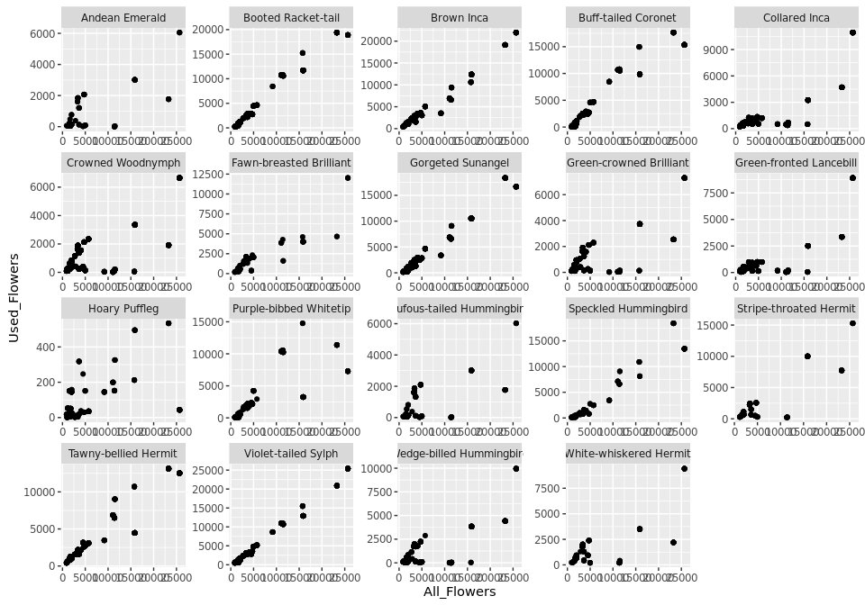
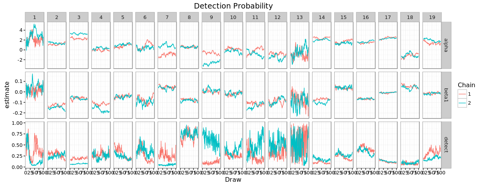
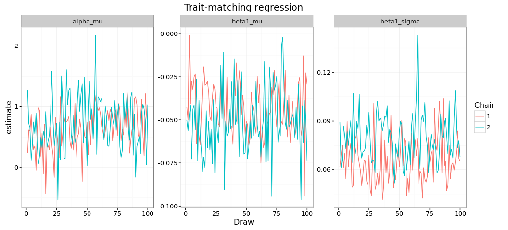
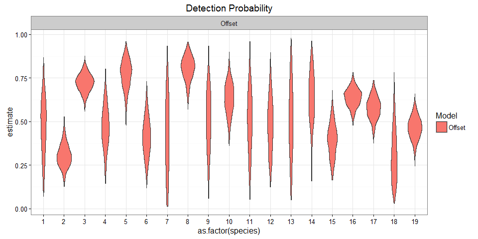
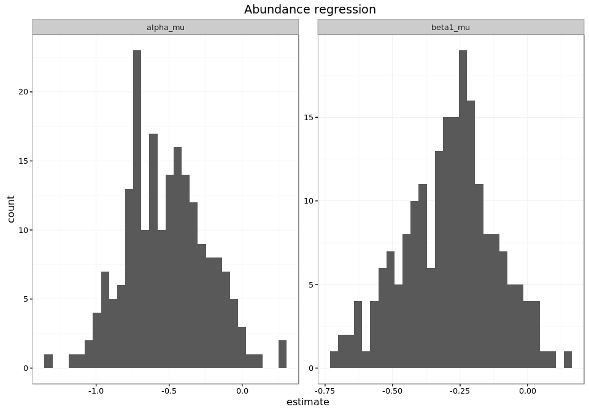

# Hierarchical Nmixture Models for species interactions: Empirical Data
Ben Weinstein - Stony Brook University  


```
## [1] "Run Completed at 2016-07-29 07:39:13"
```


What elevation transect is each observation in?
The camera data need to be inferred from the GPS point.





# Model Comparison

For hummingbird i visiting plant j recorded by camera k on day d:

$$ Y_{i,j,k,d} \sim Binom(N_{i,j,k},\omega_i)$$
$$N_{i,j,k} \sim Pois(\lambda_{i,j,k} * \Resource_{i,j,k}) $$
$$log(\lambda_{i,j})<-\alpha_i + \beta_{1,i} * |Bill_i - Corolla_j|$$ 


$$ Y_{i,j,k,d} \sim Binom(N_{i,j,k},\omega_i)$$
$$N_{i,j,k} \sim Pois(\lambda_{i,j,k} ) $$
$$log(\lambda_{i,j})<-\alpha_i + \beta_{1,i} * |Bill_i - Corolla_j| + \beta_{2,i} * \Resource_{i,j,k}$$ 

# Original Model

Abundance as a covariate.


```
##  [1]                                                                                            
##  [2] sink("Bayesian/NmixturePoissonRagged.jags")                                                
##  [3]                                                                                            
##  [4] cat("                                                                                      
##  [5]     model {                                                                                
##  [6]     #Compute intensity for each pair of birds and plants                                   
##  [7]     for (i in 1:Birds){                                                                    
##  [8]     for (j in 1:Plants){                                                                   
##  [9]     for (k in 1:Times){                                                                    
## [10]                                                                                            
## [11]     #Process Model                                                                         
## [12]     log(lambda[i,j,k])<-alpha[i] + beta1[i] * Traitmatch[i,j] + beta2[i] * resources[i,j,k]
## [13]                                                                                            
## [14]     #For each Time - there is a latent count                                               
## [15]     N[i,j,k] ~ dpois(lambda[i,j,k])                                                        
## [16]     }                                                                                      
## [17]     }                                                                                      
## [18]     }                                                                                      
## [19]                                                                                            
## [20]                                                                                            
## [21]     #Observed counts for each day of sampling at that Time                                 
## [22]     for (x in 1:Nobs){                                                                     
## [23]                                                                                            
## [24]     #Observation Process                                                                   
## [25]     Yobs[x] ~ dbin(detect[Bird[x]],N[Bird[x],Plant[x],Time[x]])                            
## [26]                                                                                            
## [27]     #Assess Model Fit                                                                      
## [28]                                                                                            
## [29]     #Fit discrepancy statistics                                                            
## [30]     eval[x]<-detect[Bird[x]]*N[Bird[x],Plant[x],Time[x]]                                   
## [31]     E[x]<-pow((Yobs[x]-eval[x]),2)/(eval[x]+0.5)                                           
## [32]                                                                                            
## [33]     ynew[x]~dbin(detect[Bird[x]],N[Bird[x],Plant[x],Time[x]])                              
## [34]     E.new[x]<-pow((ynew[x]-eval[x]),2)/(eval[x]+0.5)                                       
## [35]                                                                                            
## [36]     }                                                                                      
## [37]                                                                                            
## [38]        #Priors                                                                             
## [39]     #Observation model                                                                     
## [40]     #Detect priors, logit transformed - Following lunn 2012 p85                            
## [41]                                                                                            
## [42]     for(x in 1:Birds){                                                                     
## [43]     #For Cameras                                                                           
## [44]     logit(detect[x])<-dcam[x]                                                              
## [45]     dcam[x] ~ dnorm(dprior,tau_dcam)                                                       
## [46]     }                                                                                      
## [47]                                                                                            
## [48]     #Detection group prior                                                                 
## [49]     dprior ~ dnorm(0,0.386)                                                                
## [50]                                                                                            
## [51]     #Group effect detect camera                                                            
## [52]     tau_dcam ~  dt(0,1,1)I(0,)                                                             
## [53]     sigma_dcam<-pow(1/tau_dcam,.5)                                                         
## [54]                                                                                            
## [55]     #Process Model                                                                         
## [56]     #Species level priors                                                                  
## [57]     for (i in 1:Birds){                                                                    
## [58]                                                                                            
## [59]     #Intercept                                                                             
## [60]     alpha[i] ~ dnorm(alpha_mu,alpha_tau)                                                   
## [61]                                                                                            
## [62]     #Traits slope                                                                          
## [63]     beta1[i] ~ dnorm(beta1_mu,beta1_tau)                                                   
## [64]     beta2[i] ~ dnorm(beta2_mu,beta2_tau)                                                   
## [65] }                                                                                          
## [66]                                                                                            
## [67]     #Group process priors                                                                  
## [68]                                                                                            
## [69]     #Intercept                                                                             
## [70]     alpha_mu ~ dnorm(0,0.386)                                                              
## [71]     alpha_tau ~ dt(0,1,1)I(0,)                                                             
## [72]     alpha_sigma<-pow(1/alpha_tau,0.5)                                                      
## [73]                                                                                            
## [74]     #Trait                                                                                 
## [75]     beta1_mu~dnorm(0,0.386)                                                                
## [76]     beta1_tau ~ dt(0,1,1)I(0,)                                                             
## [77]     beta1_sigma<-pow(1/beta1_tau,0.5)                                                      
## [78]                                                                                            
## [79]     #Trait                                                                                 
## [80]     beta2_mu~dnorm(0,0.386)                                                                
## [81]     beta2_tau ~ dt(0,1,1)I(0,)                                                             
## [82]     beta2_sigma<-pow(1/beta2_tau,0.5)                                                      
## [83]                                                                                            
## [84]     #derived posterior check                                                               
## [85]     fit<-sum(E[]) #Discrepancy for the observed data                                       
## [86]     fitnew<-sum(E.new[])                                                                   
## [87]                                                                                            
## [88]                                                                                            
## [89]     }                                                                                      
## [90]     ",fill=TRUE)                                                                           
## [91]                                                                                            
## [92] sink()
```

```
##    user  system elapsed 
##    0.47    1.20 3797.58
```


##Assess Convergence


# Proposed Model

Abundance as an offset


```
##  [1]                                                                                               
##  [2] sink("Bayesian/NmixturePoissonRagged_offset.jags")                                            
##  [3]                                                                                               
##  [4] cat("                                                                                         
##  [5]     model {                                                                                   
##  [6]     #Compute intensity for each pair of birds and plants                                      
##  [7]     for (i in 1:Birds){                                                                       
##  [8]     for (j in 1:Plants){                                                                      
##  [9]     for (k in 1:Times){                                                                       
## [10]                                                                                               
## [11]     #Process Model                                                                            
## [12]     log(lambda[i,j,k])<-alpha[i] + beta1[i] * Traitmatch[i,j]                                 
## [13]                                                                                               
## [14]                                                                                               
## [15]     #For each camera - there is a latent count                                                
## [16]     N[i,j,k] ~ dpois(lambda[i,j,k] * resources[i,j,k] + 0.0000001)                            
## [17]     }                                                                                         
## [18]     }                                                                                         
## [19]     }                                                                                         
## [20]                                                                                               
## [21]                                                                                               
## [22]     #Observed counts for each day of sampling at that camera                                  
## [23]     for (x in 1:Nobs){                                                                        
## [24]                                                                                               
## [25]     #Observation Process                                                                      
## [26]     Yobs[x] ~ dbin(detect[Bird[x]],N[Bird[x],Plant[x],Time[x]])                               
## [27]                                                                                               
## [28]     #Assess Model Fit                                                                         
## [29]                                                                                               
## [30]     #Fit discrepancy statistics                                                               
## [31]     eval[x]<-detect[Bird[x]]*N[Bird[x],Plant[x],Time[x]] * resources[Bird[x],Plant[x],Time[x]]
## [32]     E[x]<-pow((Yobs[x]-eval[x]),2)/(eval[x]+0.5)                                              
## [33]                                                                                               
## [34]     ynew[x]~dbin(detect[Bird[x]],N[Bird[x],Plant[x],Time[x]])                                 
## [35]     E.new[x]<-pow((ynew[x]-eval[x]),2)/(eval[x]+0.5)                                          
## [36]                                                                                               
## [37]     }                                                                                         
## [38]                                                                                               
## [39]     for (i in 1:Birds){                                                                       
## [40]     logit(detect[i])<-dcam[i]                                                                 
## [41]     dcam[i] ~ dnorm(dprior,tau_dcam)                                                          
## [42]     alpha[i] ~ dnorm(alpha_mu,alpha_tau)                                                      
## [43]     beta1[i] ~ dnorm(beta1_mu,beta1_tau)                                                      
## [44]     }                                                                                         
## [45]                                                                                               
## [46]     #Hyperpriors                                                                              
## [47]                                                                                               
## [48]     #Detection group prior                                                                    
## [49]     dprior ~ dnorm(0,0.386)                                                                   
## [50]                                                                                               
## [51]     #Group effect detect camera                                                               
## [52]     tau_dcam ~  dt(0,1,1)I(0,)                                                                
## [53]     sigma_dcam<-pow(1/tau_dcam,.5)                                                            
## [54]                                                                                               
## [55]     #Intercept grouping                                                                       
## [56]     alpha_mu~dnorm(0,0.0001)                                                                  
## [57]                                                                                               
## [58]     #Group intercept variance                                                                 
## [59]     alpha_sigma ~ dt(0,1,1)I(0,)                                                              
## [60]     alpha_tau <- pow(alpha_sigma,-2)                                                          
## [61]                                                                                               
## [62]     #Trait Slope                                                                              
## [63]     #Mean                                                                                     
## [64]     beta1_mu~dnorm(0,0.0001)                                                                  
## [65]                                                                                               
## [66]     #Variance                                                                                 
## [67]     beta1_sigma ~ dt(0,1,1)I(0,)                                                              
## [68]     beta1_tau <- pow(beta1_sigma,-2)                                                          
## [69]                                                                                               
## [70]     #derived posterior check                                                                  
## [71]                                                                                               
## [72]     fit<-sum(E[]) #Discrepancy for the observed data                                          
## [73]     fitnew<-sum(E.new[])                                                                      
## [74]                                                                                               
## [75]     }                                                                                         
## [76]     ",fill=TRUE)                                                                              
## [77]                                                                                               
## [78] sink()
```

```
##    user  system elapsed 
##    0.31    0.73 2250.69
```


###Assess Convergence



###Hierarcichal Posteriors




##Posteriors





###Overall predicted relationship 




##Species Predictions


##Discrepancy 

The goodness of fit is a measured as chi-squared. The expected value for each day is the detection rate * the estimate intensity of interactions. The expected value is compared to the observed value of the actual data. In addition, a replicate dataset is generated from the posterior predicted intensity. Better fitting models will have lower discrepancy values and be 
Better fitting models are smaller values and closer to the 1:1 line. A perfect model would be 0 discrepancy. This is unrealsitic given the stochasticity in the sampling processes. Rather, its better to focus on relative discrepancy. In addition, a model with 0 discrepancy would likely be seriously overfit and have little to no predictive power.


##Detection table


```
##                  Hummingbird mean lower upper
## 1             Andean Emerald 47.6  16.2  76.5
## 2         Booted Racket-tail 30.6  18.5  44.4
## 3                 Brown Inca 72.3  62.1  82.1
## 4        Buff-tailed Coronet 47.0  22.0  70.3
## 5              Collared Inca 77.1  58.5  91.2
## 6          Crowned Woodnymph 41.3  21.0  63.6
## 7    Fawn-breasted Brilliant 42.9   3.8  81.3
## 8          Gorgeted Sunangel 80.6  65.6  92.3
## 9    Green-crowned Brilliant 50.7  14.4  80.3
## 10   Green-fronted Lancebill 63.2  44.2  80.5
## 11             Hoary Puffleg 50.9  16.0  86.4
## 12    Purple-bibbed Whitetip 48.2  20.1  77.5
## 13 Rufous-tailed Hummingbird 50.9  11.9  88.9
## 14      Speckled Hummingbird 63.1  23.7  89.0
## 15    Stripe-throated Hermit 39.4  20.9  57.8
## 16      Tawny-bellied Hermit 63.9  53.3  73.8
## 17       Violet-tailed Sylph 57.9  44.6  69.8
## 18  Wedge-billed Hummingbird 30.8   8.0  63.3
## 19    White-whiskered Hermit 46.6  33.6  58.6
```


