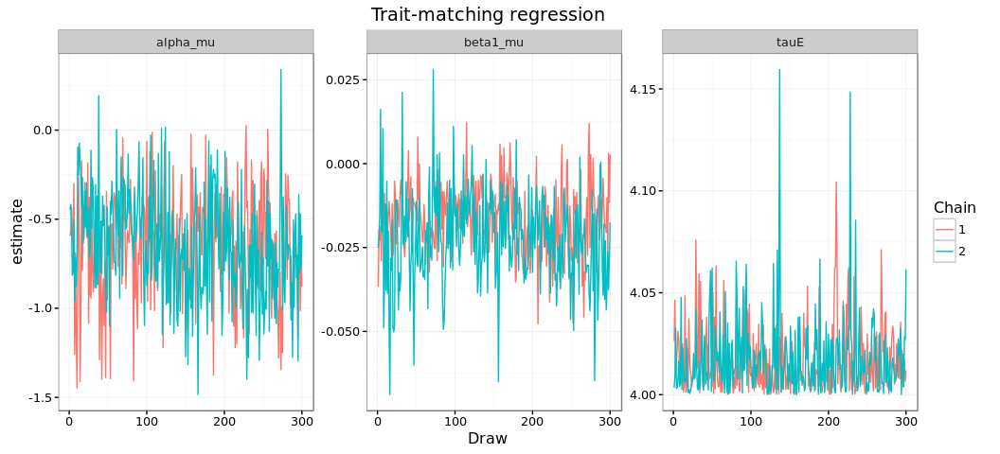
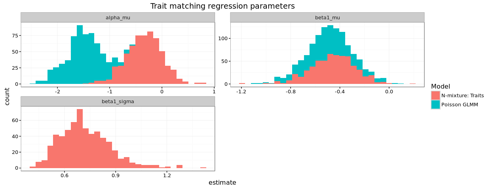
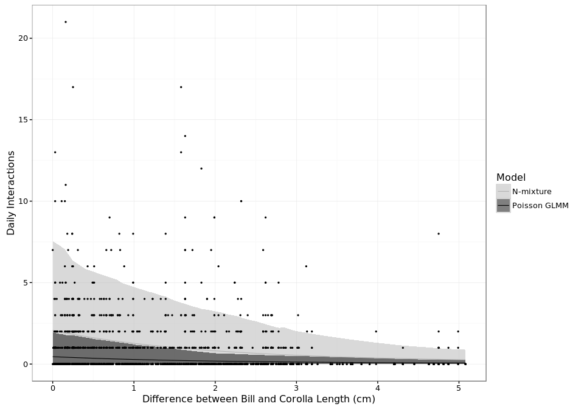

# Hierarchical Nmixture Models for species interactions: How should abundance be included?
Ben Weinstein  


```
## [1] "Run Completed at 2016-07-30 16:20:13"
```


What elevation transect is each observation in?
The camera data need to be inferred from the GPS point.


# Model Comparison


For hummingbird i visiting plant j recorded by camera k on day d:

## Abundance as a covariate

$$ Y_{i,j,k,d} \sim Binom(N_{i,j,k},\omega_i)$$
$$N_{i,j,k} \sim Pois(\lambda_{i,j,k} ) $$
$$log(\lambda_{i,j})<-\alpha_i + \beta_{1,i} * |Bill_i - Corolla_j| + \beta_{2,i} * Resource_{i,j,k}$$ 

Where resources are the total count of flower i on month k

## Presence as an offset


$$ Y_{i,j,k,d} \sim Binom(N_{i,j,k},\omega_i)$$
$$N_{i,j,k} \sim Pois(\lambda_{i,j,k} * Resource_{i,j,k}) $$
$$log(\lambda_{i,j})<-\alpha_i + \beta_{1,i} * |Bill_i - Corolla_j|$$ 


Where resources is the presences of flower i on month k

## Abundance as an offset

$$ Y_{i,j,k,d} \sim Binom(N_{i,j,k},\omega_i)$$
$$N_{i,j,k} \sim Pois(\lambda_{i,j,k} * Resource_{i,j,k}) $$
$$log(\lambda_{i,j})<-\alpha_i + \beta_{1,i} * |Bill_i - Corolla_j|$$ 

Where resources are the total count of flower i on month k

# Abundance as a Covariate


```
##     user   system  elapsed 
##    0.322    0.028 1630.373
```


# Offset: Presence


```
##     user   system  elapsed 
##    0.199    0.013 1142.028
```


# Offset: Abundance


```
##     user   system  elapsed 
##    0.288    0.035 3906.143
```


## How do the models differ in posterior estimates.





##Overall predicted relationship of trait-matching


##Species Predictions


##Discrepancy 

The goodness of fit is a measured as chi-squared. The expected value for each day is the detection rate * the estimate intensity of interactions. The expected value is compared to the observed value of the actual data. In addition, a replicate dataset is generated from the posterior predicted intensity. Better fitting models will have lower discrepancy values and be 
Better fitting models are smaller values and closer to the 1:1 line. A perfect model would be 0 discrepancy. This is unrealsitic given the stochasticity in the sampling processes. Rather, its better to focus on relative discrepancy. In addition, a model with 0 discrepancy would likely be seriously overfit and have little to no predictive power.


Zoom in on just the presence/absence model





#table

```
## Source: local data frame [3 x 2]
## 
##              Model   mean(fit)
##              (chr)       (dbl)
## 1        Covariate    1339.887
## 2 Offset_abundance 1415707.233
## 3  Offset_presence    1482.229
```

##Detection table


```
##                  Hummingbird mean lower upper
## 1             Andean Emerald 49.3  20.8  78.2
## 2         Booted Racket-tail 30.8  16.8  49.0
## 3                 Brown Inca 72.2  61.6  81.6
## 4        Buff-tailed Coronet 44.9  22.2  68.2
## 5              Collared Inca 77.7  59.9  91.5
## 6          Crowned Woodnymph 39.9  19.2  60.5
## 7    Fawn-breasted Brilliant 36.6   6.5  78.0
## 8          Gorgeted Sunangel 80.6  63.9  91.8
## 9    Green-crowned Brilliant 50.8  19.4  81.2
## 10   Green-fronted Lancebill 64.4  46.3  80.2
## 11             Hoary Puffleg 50.0  18.1  84.5
## 12    Purple-bibbed Whitetip 46.7  18.1  74.8
## 13 Rufous-tailed Hummingbird 52.4  14.3  89.8
## 14      Speckled Hummingbird 63.6  31.4  89.4
## 15    Stripe-throated Hermit 39.7  19.2  59.0
## 16      Tawny-bellied Hermit 63.9  53.2  73.1
## 17       Violet-tailed Sylph 57.5  45.6  69.0
## 18  Wedge-billed Hummingbird 30.8   9.7  60.4
## 19    White-whiskered Hermit 46.8  35.0  58.5
```

##Conclusion

* The covariate model fits the data better, provides a more direct measure of trait-matching, and produces homogenous residuals.
* The presence offset is slightly worse and overestimates (or atleast increases) the detection probabilities
* The abundance offset is not a well fitting model for our data.

The offset presence model would seem very similiar to the covariate model if the predicted effect of abundance is 0, why is it different? We believe that since we know the plant had to exist at month k, setting 0 to presence values is intentionally misleading, falsely stating that we know the presence status to be 0, and therefore attributing that missed interaction to the likelihood of trait-matching. Yet we know for certain that the presence status is actually the opposite. We know for a fact that the plant was present, since there is a camera placed on it. It therefore must be non-detected! Much better to think of the abundance covariate of 0 as ‘very low abundance’ and allow interactions to be predicted rather than truly absent. It seems illogical to have a model where in the cases of perfect detection (Presence_jk), the covariate disappears entirely, and when non-detections occur, it contributes misinformation to the model.


