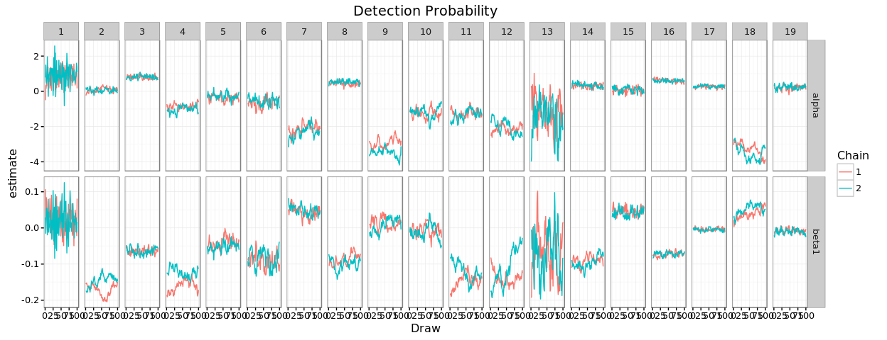
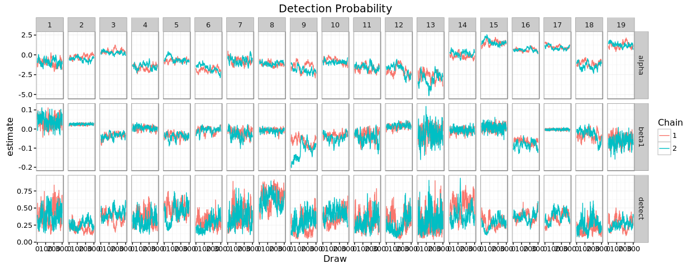
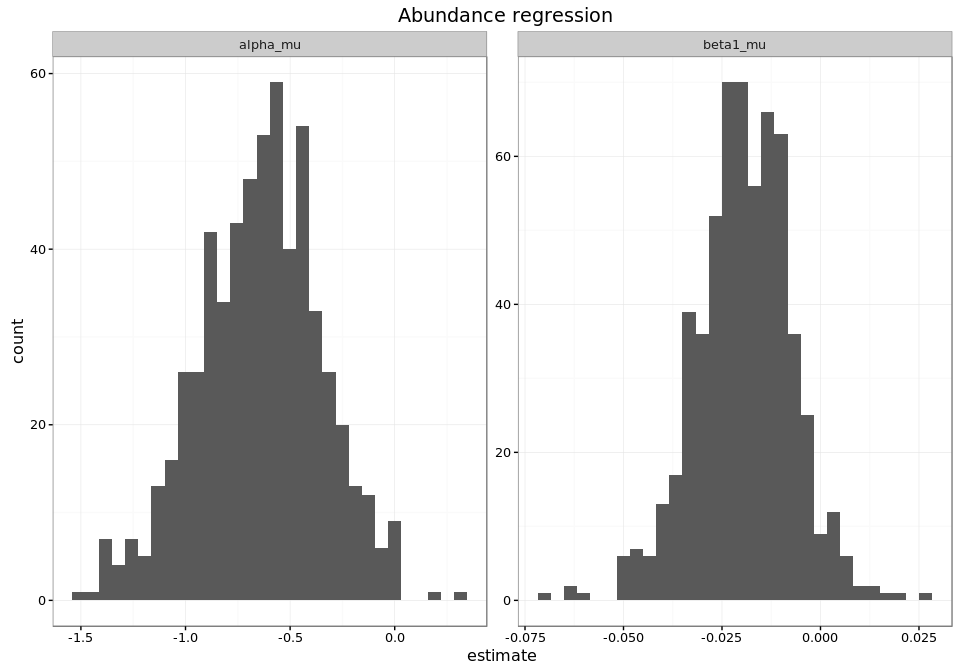
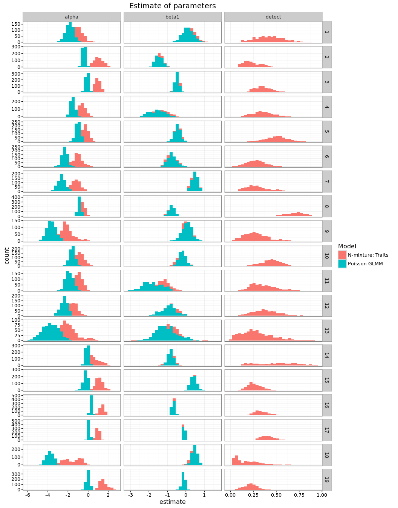
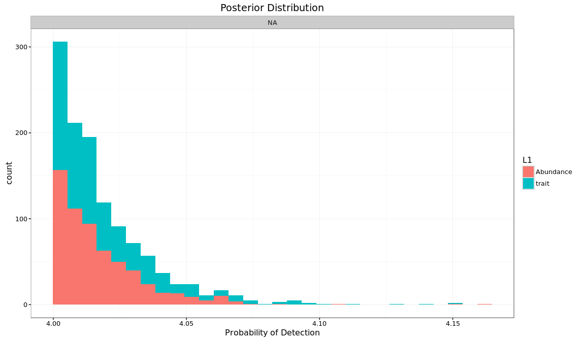

# Hierarchical Nmixture Models for species interactions: Empirical Data
Ben Weinstein - Stony Brook University  


```
## [1] "Run Completed at 2016-07-29 23:36:12"
```


What elevation transect is each observation in?
The camera data need to be inferred from the GPS point.


# Model Comparison


For hummingbird i visiting plant j recorded by camera k on day d:

## Abundance as a covariate

$$ Y_{i,j,k,d} \sim Binom(N_{i,j,k},\omega_i)$$
$$N_{i,j,k} \sim Pois(\lambda_{i,j,k} * Resource_{i,j,k}) $$
$$log(\lambda_{i,j})<-\alpha_i + \beta_{1,i} * |Bill_i - Corolla_j|$$ 

Where resources are the total count of flower i on month k

## Presence as an offset

$$ Y_{i,j,k,d} \sim Binom(N_{i,j,k},\omega_i)$$
$$N_{i,j,k} \sim Pois(\lambda_{i,j,k} ) $$
$$log(\lambda_{i,j})<-\alpha_i + \beta_{1,i} * |Bill_i - Corolla_j| + \beta_{2,i} * Resource_{i,j,k}$$ 

Where resources is the presences of flower i on month k

## Abundance as an offset
$$ Y_{i,j,k,d} \sim Binom(N_{i,j,k},\omega_i)$$
$$N_{i,j,k} \sim Pois(\lambda_{i,j,k} ) $$
$$log(\lambda_{i,j})<-\alpha_i + \beta_{1,i} * |Bill_i - Corolla_j| + \beta_{2,i} * Resource_{i,j,k}$$ 

Where resources are the total count of flower i on month k

# Abundance as a Covariate


```
##     user   system  elapsed 
##    0.355    0.040 1386.357
```


##Assess Convergence




# Offset: Presence


```
##    user  system elapsed 
##   0.135   0.034 868.557
```


###Assess Convergence


# Offset: Abundance


```
##     user   system  elapsed 
##    0.254    0.051 2884.596
```


###Assess Convergence


##Posteriors






###Overall predicted relationship 




##Species Predictions


##Discrepancy 

The goodness of fit is a measured as chi-squared. The expected value for each day is the detection rate * the estimate intensity of interactions. The expected value is compared to the observed value of the actual data. In addition, a replicate dataset is generated from the posterior predicted intensity. Better fitting models will have lower discrepancy values and be 
Better fitting models are smaller values and closer to the 1:1 line. A perfect model would be 0 discrepancy. This is unrealsitic given the stochasticity in the sampling processes. Rather, its better to focus on relative discrepancy. In addition, a model with 0 discrepancy would likely be seriously overfit and have little to no predictive power.




#table

```
## Source: local data frame [3 x 2]
## 
##              Model   mean(fit)
##              (chr)       (dbl)
## 1        Covariate    1268.142
## 2 Offset_abundance 1428095.929
## 3  Offset_presence    1472.926
```

##Detection table


```
##                  Hummingbird mean lower upper
## 1             Andean Emerald 50.1  24.0  77.9
## 2         Booted Racket-tail 32.9  18.7  49.4
## 3                 Brown Inca 72.0  60.8  81.3
## 4        Buff-tailed Coronet 47.2  24.7  68.2
## 5              Collared Inca 77.1  60.3  90.5
## 6          Crowned Woodnymph 40.0  21.3  61.9
## 7    Fawn-breasted Brilliant 44.2  12.8  81.0
## 8          Gorgeted Sunangel 79.7  63.1  91.8
## 9    Green-crowned Brilliant 51.8  19.4  83.9
## 10   Green-fronted Lancebill 64.2  45.5  80.5
## 11             Hoary Puffleg 50.3  16.7  81.9
## 12    Purple-bibbed Whitetip 47.7  19.2  75.9
## 13 Rufous-tailed Hummingbird 52.5  16.3  87.3
## 14      Speckled Hummingbird 62.2  31.4  88.9
## 15    Stripe-throated Hermit 41.0  25.7  58.3
## 16      Tawny-bellied Hermit 64.0  53.9  73.1
## 17       Violet-tailed Sylph 57.5  43.9  70.0
## 18  Wedge-billed Hummingbird 31.2   7.5  61.6
## 19    White-whiskered Hermit 46.6  34.4  58.8
```


